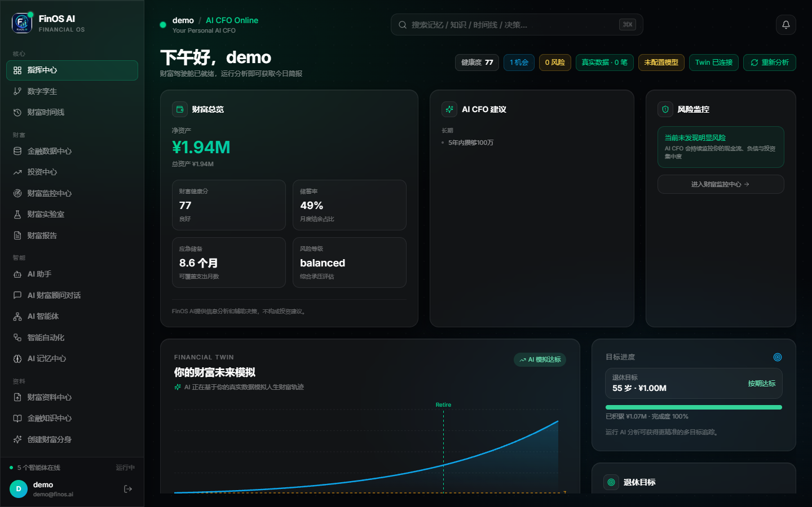
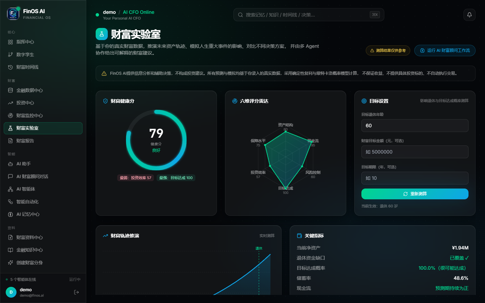
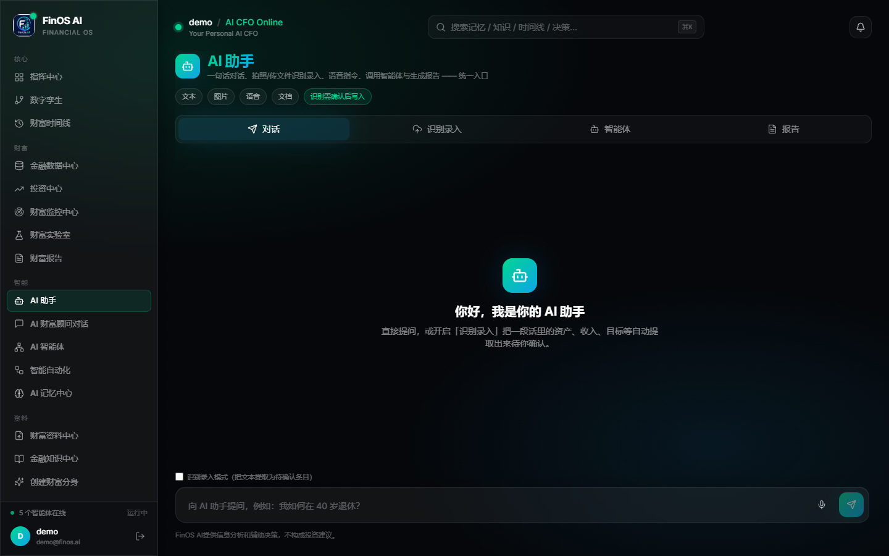
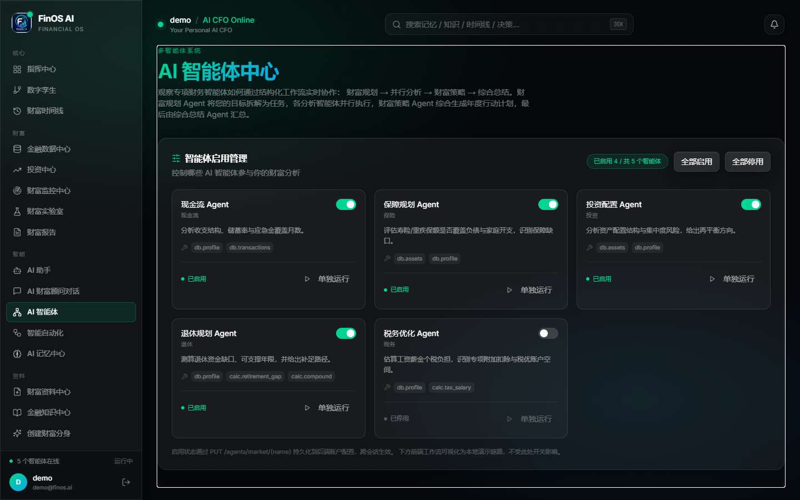
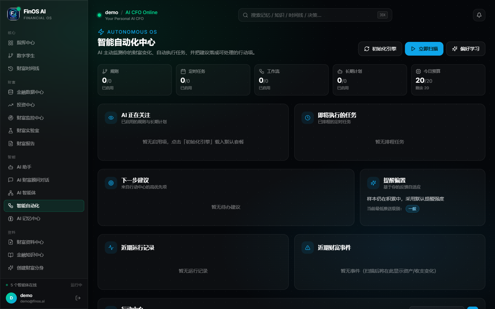
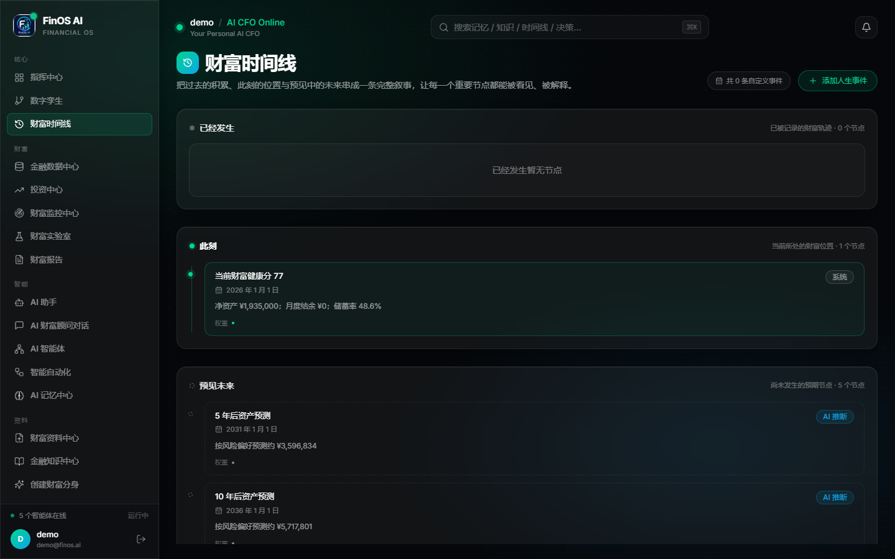
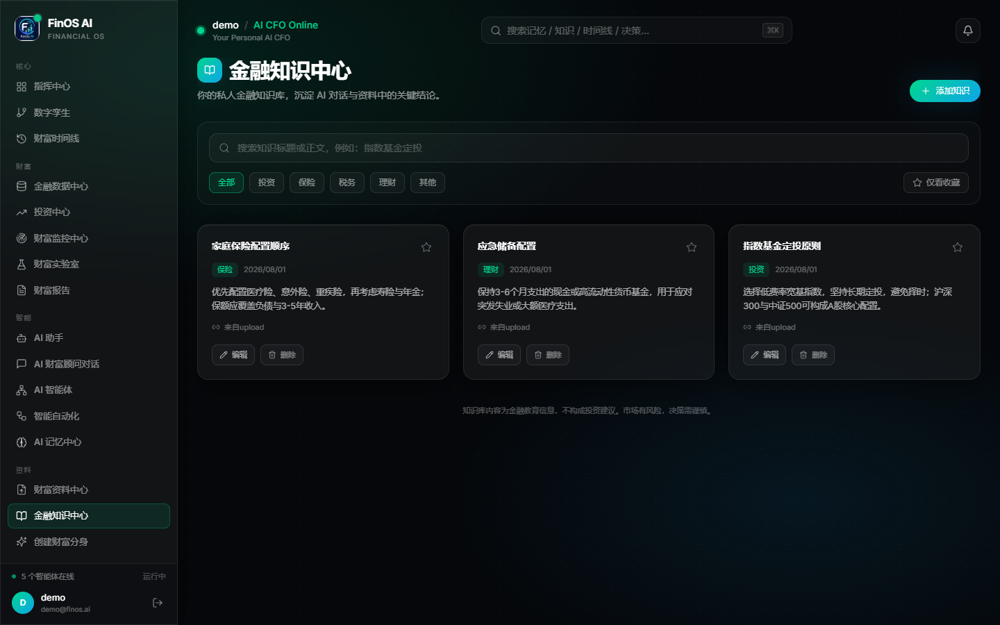
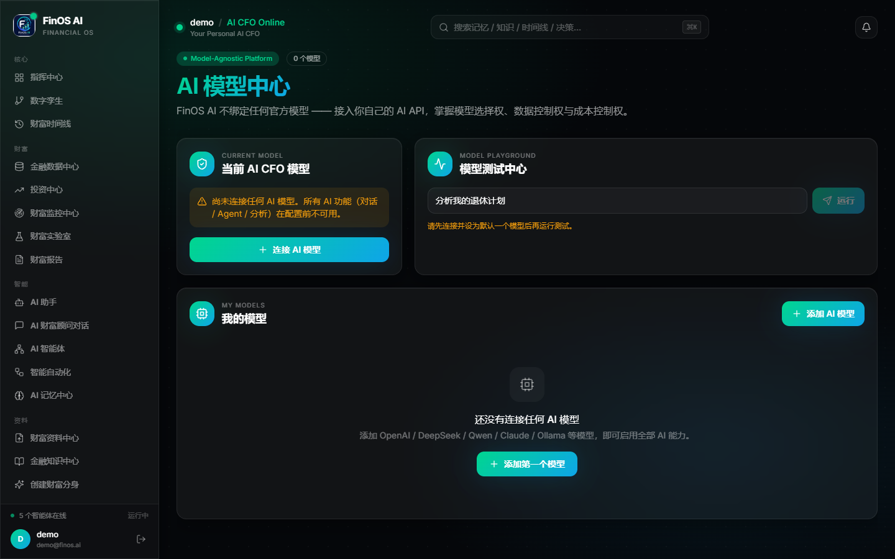

<div align="center">

# FinOS AI

**你的个人财富数字分身 —— 开源的 Personal Wealth OS**

把分散的资产、现金流与目标，汇聚成一个可对话、可推演、可主动提醒的财富数字分身。

[](./LICENSE)
[](https://nextjs.org/)
[](https://fastapi.tiangolo.com/)
[](https://www.python.org/)
[](./tests/README.md)

[快速开始](#快速开始) · [功能一览](#功能一览) · [架构](#技术架构) · [文档](#文档) · [测试](#测试)

</div>

---

## 这是什么

FinOS AI 是一个**完全开源、自托管**的个人财富操作系统。它不是记账软件，也不是荐股工具，
而是一个把你的真实财务状况建成「数字分身」的系统——你可以向它提问、让它推演未来、
由它主动发现问题并提醒你。

**三条设计底线：**

- **数据是你的。** 全部自托管，字段级 AES-256-GCM 加密，严格用户隔离，不上传任何第三方。
- **模型是你的。** BYOM（Bring Your Own Model），在应用内填自己的 API Key。项目不内置、
  不代理、不转售任何模型服务。
- **没有付费墙。** 无套餐、无订阅、无会员、无交易撮合。MIT 协议，功能全开。

> FinOS AI 提供信息分析和辅助决策，**不构成投资建议**。

---

## 功能一览

### 财富总览：一眼看清全貌

首页以 Bento Grid 组织六大区域——净资产、健康度、现金流、数字分身轨迹、
AI 洞察与待办行动，所有数字均来自你真实录入的数据，零数据时不编造任何默认值。



### 财富实验室：六维评分与目标推演

财富健康分由资产结构、现金流、风险抵御、目标达成、投资效率、保障水平六个维度加权得出，
每一维都给出可执行的改进建议，并可对目标做蒙特卡洛式概率推演。



### AI 助手：对话、识别录入、智能体、报告

一个入口整合四种能力：自然语言对话理解你的财务问题、上传账单截图自动识别录入、
调度专项智能体深度分析、一键生成结构化财富报告。



### 智能体生态：五个专项 AI CFO

内置投资、现金流、保险、退休、税务五个专项智能体，各自持有独立的分析框架与工具集，
可单独运行也可编排成多智能体工作流。**每个智能体的工具上下文都锁定在调用者自己的数据上。**



### 自动化：让系统主动为你工作

事件驱动的规则引擎 + 定时任务 + 多步工作流 + AI 主动计划。行情数据源不可用时
自动降级为确定性本地算法，LLM 预算耗尽时回落本地推理——**任何情况下都不白屏**。



### 财富时间线：过去、现在与未来

把资产变动、重大决策、目标节点串成一条可回溯的时间线，并向前推演 5 年、10 年的净值轨迹。



### 知识库：你自己的财务知识资产

沉淀属于你的投资笔记与决策依据，AI 回答问题时会检索这些私有知识作为上下文（RAG）。
**知识片段严格按用户隔离，跨用户零泄露。**



### 模型中心：接入你自己的大模型

填入任意 OpenAI 兼容端点即可。API Key 加密入库、界面只显示掩码、
任何接口都不会回传明文。**未连接模型时，系统仍能通过本地确定性算法正常工作。**



---

## 技术架构

```
                          ┌─────────────────┐
                          │      用户        │
                          └────────┬────────┘
                                   │ HTTPS
                          ┌────────▼────────┐
                          │      nginx      │  反代 / 限流 / TLS
                          └───┬─────────┬───┘
                     ┌────────┘         └────────┐
            ┌────────▼────────┐        ┌─────────▼─────────┐
            │   Next.js 15    │        │     FastAPI       │
            │   App Router    │───────▶│   24 个路由模块    │
            │   React 19      │  /api  │   178 个端点       │
            └─────────────────┘        └─────────┬─────────┘
                                                 │
                    ┌────────────────────────────┼────────────────────┐
                    │                            │                    │
           ┌────────▼────────┐        ┌──────────▼─────────┐  ┌───────▼───────┐
           │  Financial Twin │        │    AI 网关          │  │  PostgreSQL   │
           │   财富中枢建模    │        │  BYOM + 降级链      │  │   44 张表      │
           └─────────────────┘        └──────────┬─────────┘  └───────────────┘
                                                 │
                              ┌──────────────────┼──────────────────┐
                              │                  │                  │
                       ┌──────▼──────┐   ┌───────▼──────┐   ┌───────▼──────┐
                       │  用户模型     │   │  本地确定性   │   │   RAG 检索    │
                       │  (BYOM)      │──▶│  算法兜底     │   │   私有知识     │
                       └─────────────┘   └──────────────┘   └──────────────┘
                            首选              永不失败            上下文增强
```

**AI 降级链**是整个系统的可用性基石：用户模型 → 超时/失败 → 预算耗尽 → **本地确定性算法**。
最后一环不依赖任何外部服务，因此「没有大模型也能用」是被测试守住的硬承诺，不是口号。

| 层 | 技术 |
| --- | --- |
| 前端 | Next.js 15（App Router）· React 19 · TypeScript strict · Tailwind CSS · Zustand · TanStack Query v5 · Framer Motion |
| 后端 | FastAPI · SQLAlchemy 2.0 · Uvicorn · Pydantic v2 |
| 数据 | 开发 SQLite（零依赖即跑）· 生产 PostgreSQL 16 + Redis 7（缓存/限流，可降级） |
| AI | 统一网关（OpenAI 兼容端点）· RAG 本地检索 · 多智能体编排 · 本地确定性兜底 |
| 安全 | AES-256-GCM 字段加密 · bcrypt · JWT 双令牌轮换 · CSRF 双提交 · 滑动窗口限流 |
| 部署 | Docker Compose 五服务一键起（nginx / web / api / db / redis） |

---

## 快速开始

### 方式一：Docker 一键部署（推荐）

```bash
git clone <repository-url> finos-ai
cd finos-ai
bash deploy.sh
```

脚本会自动检查 Docker 环境、由 `.env.example` 生成 `.env` 并**随机生成所有密钥**、
构建镜像、拉起五个服务并轮询健康检查。完成后访问 **http://localhost** 即可。

| 命令 | 说明 |
| --- | --- |
| `bash deploy.sh` | 本地 / 内网部署（HTTP） |
| `bash deploy.sh --prod` | 生产部署（HTTPS，需先放入 TLS 证书） |
| `bash deploy.sh --rebuild` | 无缓存强制重建 |
| `bash deploy.sh --down` | 停止服务（**数据卷保留**） |
| `bash deploy.sh --logs` | 跟随查看全部日志 |

### 方式二：本地开发

**后端**（Python 3.11+）：

```bash
pip install -r backend/requirements.txt

# 注意：模块路径必须用点号 backend.main:app
# 写成 backend/main:app 会报 "Could not import module"（斜杠在 Python import 中非法）
PYTHONPATH=. python -m uvicorn backend.main:app --host 0.0.0.0 --port 8300 --reload

# 或使用稳健启动器，自动处理路径问题
PYTHONPATH=. python scripts/run_backend_local.py
```

**前端**（Node 20+）：

```bash
npm install
npm run dev            # http://localhost:3000
```

> **本地开发注意**：浏览器从前端端口跨域调后端（8300）时，
> 后端 `CORS_ORIGINS` 必须包含前端 origin，否则登录请求会被 CORS 拦截，
> 表现为「登录后被弹回登录页」。默认白名单已含 3000/3001/3002/3100。

后端默认使用 `backend/data/finos.db`（SQLite），所有接口挂在 `/api` 前缀下。
健康检查：`http://localhost:8300/api/health`。

新用户首次进入会走 5 步「创建数字分身」向导；**零数据时不渲染任何默认财富数字**。

---

## 使用指南

从注册到用出价值，大致是这么一条路径。

### 第 1 步：创建你的财富数字分身

注册后系统会引导你走 5 步向导：**基本情况 → 资产 → 负债 → 收支 → 目标**。

- 不必一次填完。只填了资产也能用，后续在「财富总览 → 数据管理」随时补。
- 填得越全，六维评分与推演越准。缺项不会被系统猜测填充，只会如实标为未知。
- 金额字段落盘即加密，数据库里看到的是密文。

### 第 2 步：接入你自己的大模型（可选但推荐）

进入 **模型中心**，填写 API Key、Base URL 与模型名，点「测试连接」验证后保存。

- 支持任何 **OpenAI 兼容协议** 的服务（官方 API、国内厂商、本地 Ollama / vLLM 均可）。
- Key 加密存储，界面与任何导出接口只回显 `sk-****last4` 掩码。
- **不配也能用**：评分、预测、智能体分析全部有本地确定性算法兜底，
  只是没有自然语言生成，输出会是结构化结论而非成段的话。

### 第 3 步：日常使用

| 你想做什么 | 去哪里 | 说明 |
| --- | --- | --- |
| 看整体状况 | **财富总览** | 净值、结构、现金流、健康分的第一落点 |
| 问一句话 | **AI 助手 → 对话** | 基于你的真实数据回答，不是通用理财问答 |
| 懒得手输 | **AI 助手 → 识别录入** | 上传账单 / 截图 / 粘贴文本，识别后**必须你确认才写入** |
| 做体检 | **财富实验室** | 六维评分 + 三段式推理，说清「为什么是这个分」 |
| 推演未来 | **财富实验室 → 情景模拟** | 调节收入、支出、收益率、通胀，看目标达成概率 |
| 找专项建议 | **智能体生态** | 现金流 / 投资 / 保险 / 退休 / 税务五个专项 AI CFO |
| 让系统主动干活 | **自动化** | 配规则与定时任务，触发后进「行动中心」等你决策 |
| 沉淀知识 | **知识库** | 上传文档建私有 RAG，AI 回答时会引用并标注来源 |

### 第 4 步：让系统主动为你工作

这是 FinOS AI 与普通记账工具的分界线。在 **自动化** 页面可以配置：

- **事件规则** —— 如「现金流缺口连续 2 个月 → 生成预警并给出补救方案」；
- **定时任务** —— 如「每周一早 8 点生成上周财富简报」；
- **多体工作流** —— 串联多个智能体产出综合策略。

所有自动产出都进 **行动中心**，由你「采纳 / 忽略」。这个反馈会回流成偏好画像，
系统越用越贴合你的风格。**它永远不会替你执行任何交易。**

### 关于数据源与模拟数据

**你的资产、负债、收支、目标，只来自你自己的录入，系统绝不虚构。**

但行情、基金净值、财经资讯、宏观指标这类**外部市场数据**，在未接入真实数据源时，
由确定性模拟 Provider 生成（同一标的每次返回一致，便于演示与验收）。
这类数据在界面上带 **「模拟数据」** 标识，注入 AI 的文本也带 `【模拟数据】` 前缀。

接入真实数据源只需实现 Provider 接口并通过环境变量切换，上层零改动：

| 变量 | 默认 | 说明 |
| --- | --- | --- |
| `FINOS_MARKET_PROVIDER` | `mock` | 市场行情数据源（`src/market/providers/`） |
| `FINOS_STOCK_PROVIDER` | `mock` | 股票报价数据源（`src/financial-data/providers/`） |
| `FINOS_FUND_PROVIDER` | `mock` | 基金净值数据源（同上） |

> 项目**不内置也不代理**任何商业行情服务。是否接入、接入哪家，由你自己决定。

---

## 环境变量

完整清单见 [`.env.example`](./.env.example) 与 [部署文档](./docs/deployment.md)。
`.env` 由 `deploy.sh` 自动生成，**切勿提交到版本库**。

| 变量 | 说明 | 生产必改 |
| --- | --- | :---: |
| `JWT_SECRET` | JWT 签名密钥，至少 32 字节随机值 | ✅ |
| `ENCRYPTION_MASTER_KEY` | AES-256-GCM 字段加密主密钥（Base64 的 32 字节） | ✅ |
| `FINOS_DATA_KEY` | 前端侧数据加密密钥（未配置时生产环境会**拒绝启动**） | ✅ |
| `POSTGRES_USER` / `POSTGRES_PASSWORD` / `POSTGRES_DB` | PostgreSQL 凭据 | ✅ |
| `REDIS_PASSWORD` | Redis 密码 | ✅ |
| `CORS_ORIGINS` | 允许跨域的前端来源，逗号分隔 | ✅ |
| `HTTP_PORT` / `WEB_PORT` / `API_PORT` | 端口（默认 80 / 3000 / 8300） | |
| `NEXT_PUBLIC_BACKEND_URL` | 浏览器侧后端基址，默认 `/api`（走 nginx 同源代理） | |
| `AI_API_KEY` / `AI_BASE_URL` / `AI_MODEL` | 可选兜底模型；推荐由用户在模型中心自助填写 | |

生成密钥：

```bash
python -c "import secrets,base64;print(base64.urlsafe_b64encode(secrets.token_bytes(32)).decode())"
```

> ⚠️ **`ENCRYPTION_MASTER_KEY` 一旦丢失，此前加密存储的所有 API Key 与敏感字段将无法解密。**
> 请务必备份 `.env`。

---

## 项目结构

```
finos-ai/
├── backend/                    # FastAPI 后端（模块化单体，24 个路由模块）
│   ├── main.py                 # 应用入口
│   ├── config/ database/ core/ # 配置 / ORM 会话 / 响应信封与鉴权
│   ├── auth/ user/             # 认证（JWT 双令牌）与账户
│   ├── financial/              # 资产 / 现金流 / Financial Twin 引擎
│   ├── intelligence/           # 财富预测 / 六维评分 / 三段式推理 / 情景模拟
│   ├── agents/                 # 智能体注册表、工具、多体工作流
│   ├── multimodal/ report/     # 多模态识别 / 报告生成
│   ├── personal_os/            # 个人 OS（时间线 / 记忆 / 知识 / 简报 / 指挥中心）
│   ├── autonomous/             # 自动化与主动服务（规则 / 定时 / 工作流 / 成本护栏）
│   ├── security/               # 加密类型、权限校验、安全中间件
│   ├── ai/ memory/ notification/ tasks/ services/
│   └── data/                   # 开发环境 SQLite
├── src/                        # Next.js 前端
│   ├── app/(dashboard)/        # 受保护主应用（25 个路由）
│   ├── app/api/                # Next 路由处理器（双鉴权桥接）
│   ├── components/             # dashboard / bento / auth 等
│   ├── lib/backend-client.ts   # 唯一后端通道（自动带 JWT、解信封）
│   └── hooks/ store/ types/
├── tests/                      # 三层测试体系
│   ├── backend/                # pytest + TestClient（79 项）
│   ├── ai/                     # 本地算法与合规口径（22 项）
│   └── frontend/               # Node 契约测试（11 项）
├── docs/                       # 完整技术文档
├── deploy/                     # Docker / nginx / 部署脚本
├── scripts/                    # 验收与工具脚本
└── docker-compose.yml
```

---

## 测试

三层测试全部可在**不连接任何大模型、不依赖外部服务**的环境下运行：

```bash
# 后端 API + AI 质量层（Python）
pip install pytest
PYTHONPATH=. pytest tests/backend tests/ai -v

# 前端契约层（Node 内置 runner，零额外依赖）
node --test tests/frontend/contract.test.mjs
```

| 层 | 数量 | 守住什么 |
| --- | :---: | --- |
| `tests/backend/` | 79 | 鉴权、用户隔离铁律、数据正确性、错误契约、密钥零泄露 |
| `tests/ai/` | 22 | 无模型时的本地算法、零数据欢迎态、合规口径 |
| `tests/frontend/` | 11 | 品牌红线、安全红线、白屏风险、开源定位 |

测试**绝不触碰开发数据库**——会在导入前改写 `DATABASE_URL` 到临时库，
每个用例前清空全部业务表。详见 [测试文档](./tests/README.md)。

---

## 文档

| 文档 | 内容 |
| --- | --- |
| [架构设计](./docs/architecture.md) | 分层设计、核心数据流、五条关键设计决策 |
| [API 参考](./docs/api.md) | 178 个端点全量清单、响应信封、鉴权约定 |
| [数据库结构](./docs/database-schema.md) | 44 张表、加密字段策略、ER 关系、索引 |
| [部署指南](./docs/deployment.md) | 环境变量、Docker、生产 HTTPS、备份恢复、故障排查 |
| [安全设计](./docs/security.md) | 认证授权、加密体系、中间件链、隐私控制、上线检查清单 |
| [AI 与智能体](./docs/ai-agent.md) | 降级链、评分引擎、智能体扩展、RAG、成本护栏 |
| [开发指南](./docs/development.md) | 代码规范、新增功能工作流、Git 规范、已知踩坑 |
| [测试说明](./tests/README.md) | 三层测试体系、装置说明、编写新用例 |

---

## 安全与隐私

- **字段级加密** —— 资产金额、收入、模型 API Key 等敏感字段以 AES-256-GCM 透明加密落盘。
- **用户隔离铁律** —— 所有业务查询强制绑定 `user_id`；越权访问一律返回 404
  （返回 403 会形成资源存在性侧信道）。
- **密钥不回传** —— 模型 API Key 只以掩码形式展示，任何接口、任何导出都不含明文。
- **生产启动守卫** —— 开源仓库中的开发兜底密钥在生产环境会**直接拒绝启动**，
  而非静默降级，避免加密形同虚设。
- **本地优先** —— 不默认绑定任何商业平台，不向第三方回传数据。
- **不虚构你的数据** —— 资产、负债、收支、目标只来自你的录入；零数据时页面显示空态引导，
  绝不填充默认财富数字。外部市场数据在未接入真实源时由模拟 Provider 生成，
  但界面与 AI 输出**一律带「模拟数据」标识**，不会伪装成真实行情。
- **可导出可删除** —— 支持完整数据导出与账户注销（需输入确认短语）。

完整说明见 [安全设计文档](./docs/security.md)。

---

## 常见问题

**启动后白屏 / 连接被拒（ERR_CONNECTION_REFUSED）？**
Docker 部署下确认 nginx 容器已 `healthy`（`docker compose ps`），浏览器访问 `http://localhost`
而非直连 3000/8300（它们仅绑 127.0.0.1）。本地开发下 90% 是后端 8300 未启动，
先确认进程再按点号路径重启。

**登录后被弹回登录页？**
两个常见原因：① 本地跨域时后端 `CORS_ORIGINS` 未含前端 origin；
② HTTP 环境下 cookie 被标记为 `Secure` 导致浏览器拒存。后者项目已按请求协议动态判断，
若你改动过 `src/auth/session.ts` 请保持该逻辑。

**想接自己的大模型？**
应用内「模型中心」填写 API Key / Base URL / 模型名即可，无需改服务端配置。

**没有配置任何模型能用吗？**
能。所有智能能力都有本地确定性算法兜底，评分、预测、智能体分析均可正常运行，
只是不具备自然语言生成能力。

**Redis 不可用会怎样？**
自动降级为进程内缓存，功能不受影响，仅失去跨实例共享缓存能力。

---

## 贡献

欢迎 Issue 与 Pull Request。提交前请阅读 [开发指南](./docs/development.md)，并确保：

- `npx tsc --noEmit` 与 `pytest` 均通过；
- 遵循提交规范（Conventional Commits）；
- **不引入任何商业套餐、支付、订阅或收费系统**——这是本项目的定位红线。

---

## License

[MIT](./LICENSE) © 2026 FinOS AI Contributors

---

<div align="center">

**免责声明**

FinOS AI 提供信息分析和辅助决策，不构成投资建议。
所有 AI 生成内容仅供参考，投资决策与风险由用户自行承担。

</div>
