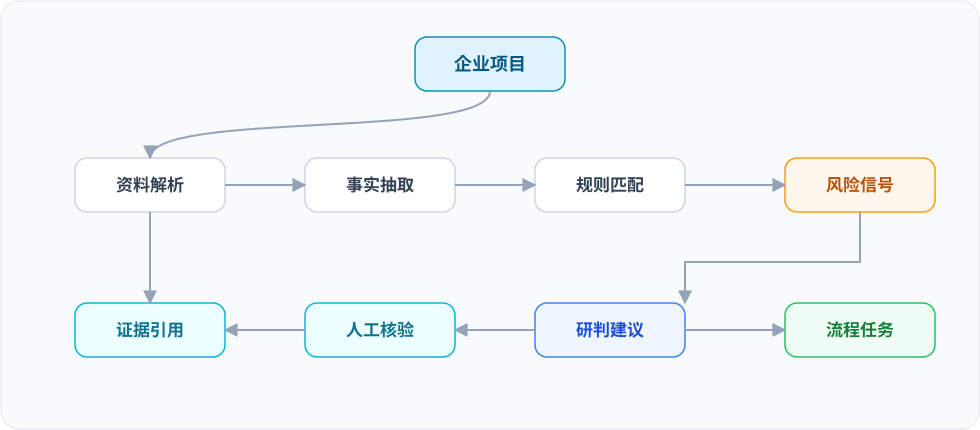
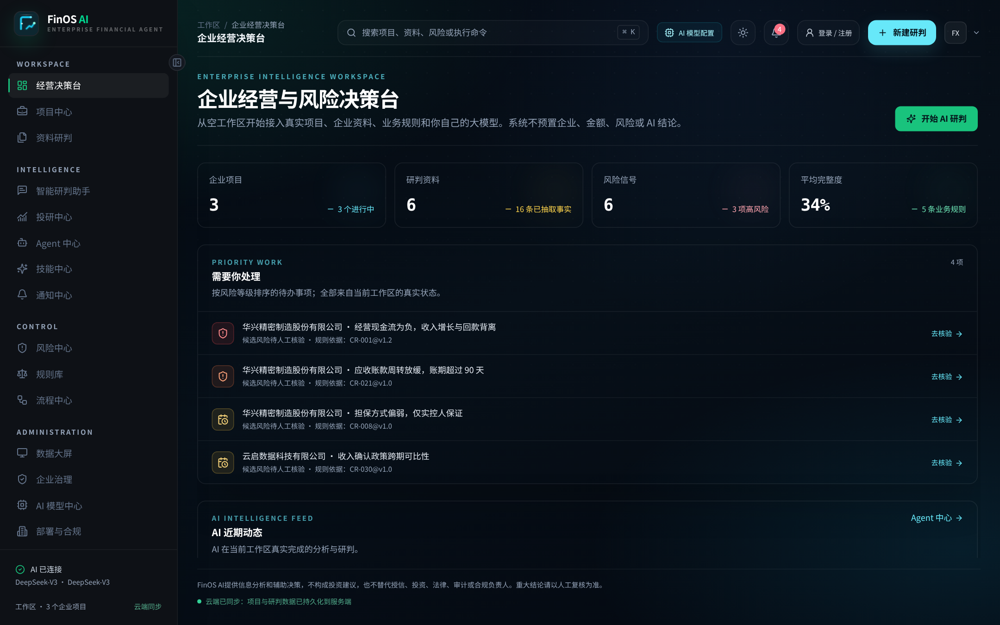
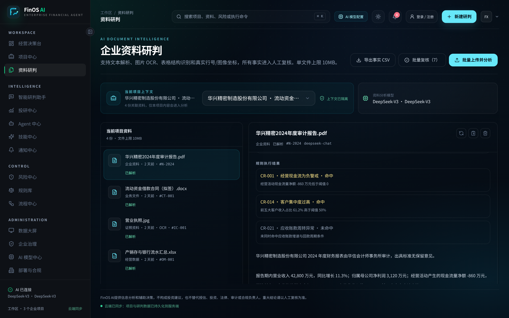
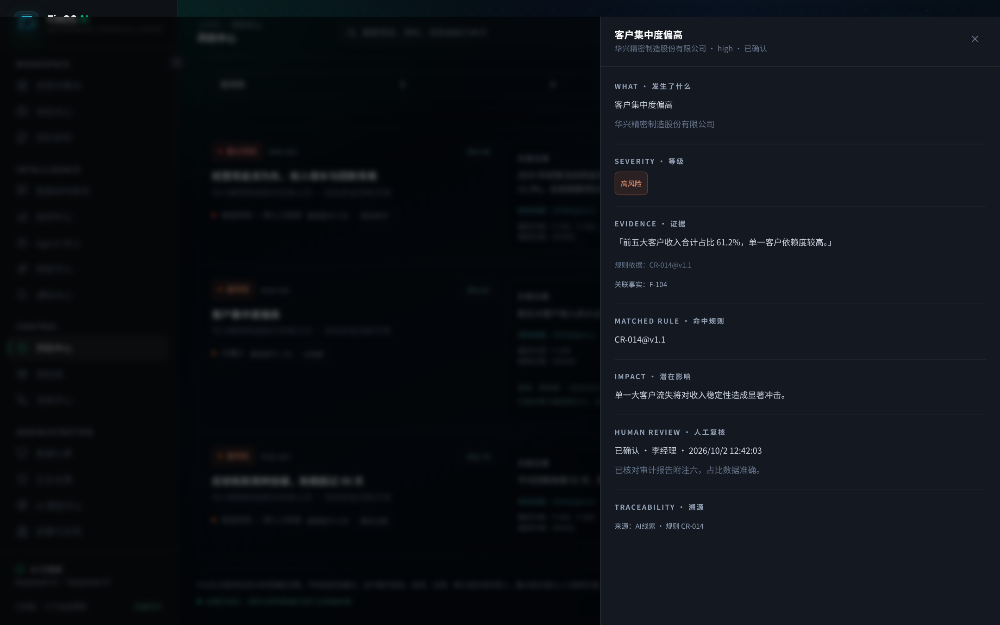
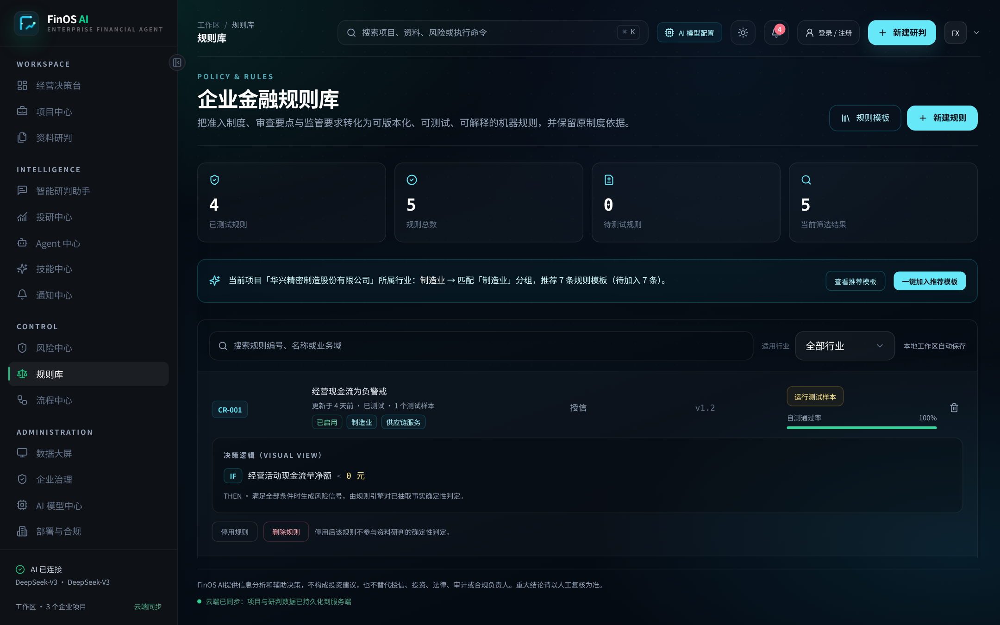
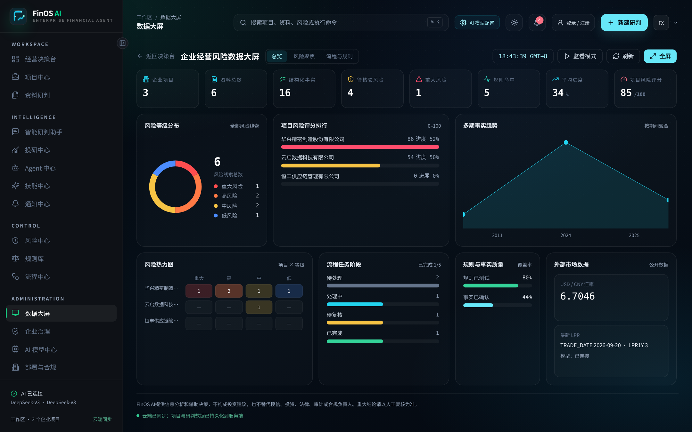
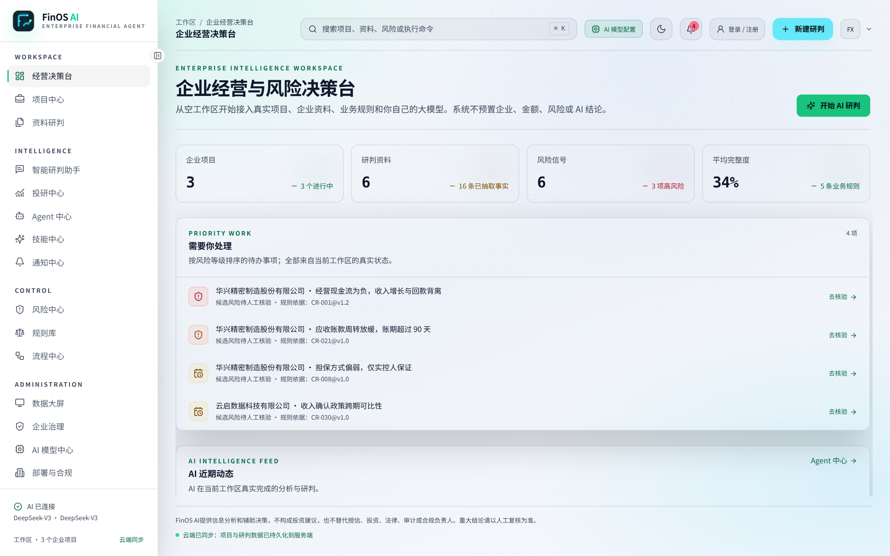

<div align="center">

# FinOS AI

### 面向企业经营与风险研判的开源金融服务 Agent

让企业资料、经营事实、业务规则与外部研究进入同一条可追溯的研判链路，辅助团队完成资料理解、规则匹配、风险提示、投研整理和流程协作。

[](https://github.com/Leterhong/FinOS-AI/actions/workflows/ci.yml)
[](./CHANGELOG.md)
[](./LICENSE)
[](https://www.typescriptlang.org/)
[](./SECURITY.md)

[图文详解](./docs/introduction.md) · [完整使用文档](./docs/user-guide.md) · [评测报告](./docs/benchmark.md) · [作品简介](./docs/pitch.md) · [价值说明](./docs/value.md) · [界面预览](#界面预览) · [快速开始](#快速开始) · [技术架构](#技术架构) · [安全边界](#安全与责任边界)

</div>

---

## FinOS AI 是什么

FinOS AI 是一个面向企业金融、产业金融、授信尽调、经营分析和风险管理场景的开源 Agent 工作台。它将原本散落在文档、表格、制度、研究材料和沟通流程中的信息组织成一条可核验的工作链路：



系统的目标是提升资料处理效率和判断透明度，让关键结论能够回答三个问题：

1. 结论基于什么资料和事实？
2. 命中了哪条规则，为什么构成风险？
3. 谁核验过，下一步需要谁处理？

当前版本 FinOS AI 2.2 已完成企业金融信息架构、可配置模型中心、AI 研判主链路与组织治理控制。开源版本无需登录即可进入零数据工作区，系统不自动创建企业、资产、风险、规则或研究结论，所有业务记录均由用户主动录入或基于真实资料生成。适用方向覆盖企业经营质量分析与融资材料预审、授信尽调与贷前核验、产业链与供应链金融研究、并购与投融资资料整理、制度规则检索与人工复核、行业政策与企业舆情投研底稿。

无登录模式使用浏览器隔离的访客身份，适合单机评估，不等同于企业身份源或共享设备隔离；生产环境仍应接入企业账户生命周期、HTTPS、密钥管理和留存策略，详见 [安全策略](./SECURITY.md) 与 [安全设计](./docs/security.md)。

> FinOS AI 提供信息分析与决策辅助，不构成投资、授信、法律、审计或合规意见。

## 界面预览

FinOS AI 采用深色金融工作台设计，浅色主题达 WCAG AA，移动端完整适配。完整图文讲解见 [图文详解](./docs/introduction.md)，安装与使用步骤见 [完整使用文档](./docs/user-guide.md)。

| 经营决策台 | 资料研判 · 事实台账 | 风险中心 · 详情 |
| --- | --- | --- |
|  |  |  |

| 规则库 · Visual View | 数据大屏 | 浅色主题 |
| --- | --- | --- |
|  |  |  |

> [图文详解](./docs/introduction.md) 收录 35 张按页面顺序编号的截图，逐页逐功能讲解从「接入模型」到「输出风险清单」的完整链路；[完整使用文档](./docs/user-guide.md) 提供安装部署、8 步操作与常见问题。

## 设计原则

Evidence first · Human in the loop · Explainable rules · Secure by default · Open and self-hosted：重要判断可回溯到原始资料、事实与引用位置，关键决策由授权人员确认，规则命中可解释，密钥不进入前端，MIT 开源可自托管。完整说明见 [图文详解 · FinOS AI 是什么](./docs/introduction.md#1-finos-ai-是什么)。

## 为什么不同

- **确定性规则引擎 + 大模型分工**：规则命中由纯函数判定，模型只负责资料理解与叙述生成，同一输入得到同一结论，可复现、可审计。
- **证据优先**：每条事实携带原文引用与行号 / 单元格 / 图像坐标，结论可逐级追溯到原始资料。
- **人机复核闭环**：候选风险必须经人工核验才成为正式风险，操作全程留痕。
- **企业治理内建**：组织角色、项目授权、数据密级、复核队列、模型评测与审计开箱可用。
- **自带模型、可自托管**：密钥在服务端加密，MIT 开源，支持私有化部署。
- **外部数据可接入**：内置汇率（ECB）、LPR、世界银行、GLEIF、SEC EDGAR 与巨潮资讯上市公司公告等免费公开数据源（无需密钥），全部标注需人工复核。

量化证据：确定性引擎 296 条基准用例 100% 通过（`npm run benchmark`，见 [评测报告](./docs/benchmark.md)）；事实抽取真实模型评测 精确率/召回率/F1 95.8%、原文引用有效性 100%（`npm run ai-eval`，见 [AI 评测报告](./docs/ai-eval.md)）。价值度量口径见 [价值量化说明](./docs/value.md)，端到端场景见 [制造业授信尽调剧本](./docs/scenario-manufacturing-credit.md)。

## 快速开始

只体验前端（Node.js 20+）：

```bash
git clone https://github.com/Leterhong/FinOS-AI.git
cd FinOS-AI
npm install
npm run dev
```

打开 <http://localhost:3000>，无需账号，也不加载任何预置业务数据。

启动完整本地服务、配置 AI 模型、Docker Compose，以及 macOS / Linux / Windows 的安装部署方法与故障排查，见 [完整使用文档 · 快速开始](./docs/user-guide.md#快速开始5-分钟上手)。生产环境需为 `JWT_SECRET`、`ENCRYPTION_MASTER_KEY`、`FINOS_DATA_KEY`、`POSTGRES_PASSWORD`、`REDIS_PASSWORD` 配置强随机值，且模型密钥不要添加 `NEXT_PUBLIC_` 前缀，详见 [环境变量配置](./docs/user-guide.md#环境变量配置)。

## 技术架构

浏览器侧 Next.js 15 / React 19 / TypeScript strict / Tailwind CSS / Zustand，经 Route Handlers 承载工作区会话、模型配置、文档解析与 AI 网关；服务端 FastAPI + SQLAlchemy 2，开发用 SQLite、生产用 PostgreSQL 16，Redis 7 可选并可降级。模型凭据以 AES-256-GCM 仅服务端加密，出站访问经 SSRF 防护。文件处理覆盖 `mammoth`（Word）、`pdf-parse`（PDF）、图片视觉 OCR 与 Excel/CSV 表格结构，并保留行号、单元格与图像坐标。

完整分层、数据流与部署拓扑见 [架构文档](./docs/architecture.md)。

## 测试与质量门禁

```bash
# TypeScript 类型检查
npm run typecheck

# 前端契约与安全回归
npm test

# 规则引擎等纯函数单测
npm run test:unit

# Next.js 生产构建
npm run build

# 后端与 AI 回归（pytest）
npm run test:backend

# 端到端主链路（本地 mock LLM，需先 build）
node tests/e2e/main-chain.mjs

# 确定性引擎评测（生成 docs/benchmark.md，不调用模型）
npm run benchmark

# 事实抽取真实评测（调用已配置模型，生成 docs/ai-eval.md）
npm run ai-eval
```

以上门禁同时由 GitHub Actions（CI + CodeQL + Dependabot）自动执行。测试使用隔离数据与本地 mock 模型，不连接任何真实模型服务。确定性引擎评测当前为 296/296（100%），可用 `npm run benchmark` 复现，结果见 [评测报告](./docs/benchmark.md)。更多信息见 [`tests/README.md`](./tests/README.md)。

## 安全与责任边界

- 短期 Access Token 仅驻留前端内存，Refresh Token 使用 HttpOnly Cookie 并以原子吊销实现轮换与重放检测。
- 上传文件分块读取并限制大小；Webhook 与模型 Base URL 拒绝本机、内网、保留地址和自动重定向，仅信任明确配置的反向代理来源。
- 模型凭据以 AES-256-GCM 加密落盘，解密失败时拒绝读写并保留原密文；模型密钥、数据库凭据和企业资料不进入公开仓库或浏览器构建。

FinOS AI 提供应用层组织角色、项目授权、数据分级、复核与审计控制，部署者仍须对接真实身份源，并完成日志留存、备份恢复、模型供应商评估和适用地区的监管合规。完整清单见 [安全策略](./SECURITY.md) 与 [安全设计](./docs/security.md)，模式对比与上线门槛见 [部署模式说明](./docs/deployment-modes.md)。发现漏洞请使用 GitHub 私密漏洞报告，不要创建公开 Issue 或上传真实企业数据。

## 参与贡献

欢迎通过 Issue 讨论产品建议，通过 Pull Request 提交改进。提交前请运行类型检查、测试和生产构建，不提交真实企业资料、个人信息、数据库或任何密钥，对安全问题使用私密报告渠道，并在涉及金融判断时保留证据、解释和人工复核边界。

## License

本项目基于 [MIT License](./LICENSE) 开源。软件按“原样”提供，不构成投资、授信、法律、审计或合规意见。
