# FinOS AI 图文详解：从企业资料到可追溯的风险研判

> 这是一篇逐页面、逐功能的深度图文介绍，覆盖 FinOS AI 从「接入模型」到「输出风险清单」的完整链路。全文 35 张界面截图均来自真实运行的前端，按页面顺序编号，方便对照阅读。
>
> 阅读建议：第一次接触 FinOS AI，请从第 1 章「核心链路」和第 2 章「五分钟上手」读起；已经部署好的团队，可以直接跳到感兴趣的模块章节。
>
> 关于截图中的企业、金额、风险与结论：这些是为了展示界面而灌入的示例数据。FinOS AI 本体不预置任何业务数据，真实工作区从零开始，所有记录都由用户主动录入或基于真实资料生成。

---

## 目录

- [1. FinOS AI 是什么](#1-finos-ai-是什么)
- [2. 核心链路：一条可追溯的研判流水线](#2-核心链路一条可追溯的研判流水线)
- [3. 五分钟上手](#3-五分钟上手)
- [4. 经营决策台与全局命令中心](#4-经营决策台与全局命令中心)
- [5. 项目中心](#5-项目中心)
- [6. 项目详情工作台](#6-项目详情工作台)
- [7. 资料研判](#7-资料研判)
- [8. 风险中心](#8-风险中心)
- [9. 规则库](#9-规则库)
- [10. 流程中心](#10-流程中心)
- [11. Agent 中心](#11-agent-中心)
- [12. 智能研判助手](#12-智能研判助手)
- [13. 投研中心](#13-投研中心)
- [14. 技能中心](#14-技能中心)
- [15. 通知中心](#15-通知中心)
- [16. 企业治理与质量控制](#16-企业治理与质量控制)
- [17. AI 模型中心](#17-ai-模型中心)
- [18. 数据大屏](#18-数据大屏)
- [19. 部署与合规准备](#19-部署与合规准备)
- [20. 使用指引](#20-使用指引)
- [21. 主题、可访问性与响应式](#21-主题可访问性与响应式)
- [22. 截图总索引](#22-截图总索引)

---

## 1. FinOS AI 是什么

FinOS AI 是一个面向企业金融、产业金融、授信尽调、经营分析和风险管理场景的开源 Agent 工作台。它把原本散落在 PDF、Word、Excel、制度文件和沟通流程里的信息，组织成一条可以逐级核验的工作链路：


它回答三个问题：

1. 结论基于什么资料和事实？
2. 命中了哪条规则，为什么构成风险？
3. 谁核验过，下一步需要谁处理？

围绕这三个问题，FinOS AI 形成四条设计原则：

| 原则 | 含义 |
| --- | --- |
| Evidence first | 重要判断必须能回到原始资料、事实字段和引用位置，界面提供「结论 → 事实 → 证据 → 来源」的逐级追溯 |
| Human in the loop | Agent 生成提示和草稿，关键决策由授权人员确认 |
| Explainable rules | 展示规则命中原因、潜在影响、证据与处理状态 |
| Secure by default | 密钥不进入前端，上传与出站访问经过安全边界 |

FinOS AI 提供信息分析与决策辅助，不构成投资、授信、法律、审计或合规意见。所有重大结论都需要有权限的业务人员复核。

---

## 2. 核心链路：一条可追溯的研判流水线

整个产品围绕同一条价值链构建，每一步都可以回溯到上一步：

```text
项目 → 资料 → 事实 → 证据 → 规则 → 风险 → AI 分析 → 人工复核 → 决策
```

对应到界面模块：

| 环节 | 承载模块 | 产物 |
| --- | --- | --- |
| 项目 | 项目中心 | 企业研判项目 |
| 资料 | 资料研判 | 解析后的文档与表格结构 |
| 事实 / 证据 | 资料研判 | 结构化事实 + 原文引用坐标 |
| 规则 | 规则库 | 可版本化、可测试的机器规则 |
| 风险 | 风险中心 | 候选风险与已确认风险 |
| AI 分析 | 智能助手 / Agent 中心 / 投研中心 | 叙述、执行轨迹、研究底稿 |
| 人工复核 | 风险中心 / 流程中心 / 企业治理 | 核验记录与审计留痕 |
| 决策 | 项目详情 / 数据大屏 | 研判报告与经营全景 |

FinOS AI 与其他工具的关键差异在于：规则命中由确定性引擎（纯函数）计算，模型负责理解资料与生成叙述，两类能力各司其职。这样既能利用大模型的语义理解，又能保证规则判定可复现、可解释。

---

## 3. 五分钟上手

### 3.1 只体验前端

要求 Node.js 20+。

```bash
git clone https://github.com/Leterhong/FinOS-AI.git
cd FinOS-AI
npm install
npm run dev
```

打开 <http://localhost:3000>。首次进入不需要账号，也不会加载任何预置业务数据。

### 3.2 接入你自己的模型

FinOS AI 采用「自带模型」模式，AI 能力需要先接入一个真实的大模型：

1. 打开 `/models`，选择供应商（DeepSeek、OpenAI、通义千问、Claude、Gemini、智谱、Kimi、Ollama 或任意 OpenAI 兼容服务）。
2. 填写 API Key、模型名称与可选接口地址，并选择任务角色（通用默认、对话、复杂研判、图像理解、长文档）。
3. 保存后点击「测试连接」，通过真实 API 请求验证回答、延迟与 Token 用量。
4. 测试通过的配置可以设为默认模型，随后在助手、资料研判、Agent 中心和投研中心发起调用。

API Key 通过工作区会话隔离，在服务端使用 AES-256-GCM 加密保存，返回浏览器时只提供掩码。

### 3.3 启动完整本地服务

要求 Node.js 20+、Python 3.11+。macOS / Linux：

```bash
python3 -m venv .venv
source .venv/bin/activate
pip install -r backend/requirements.txt

# 本地开发：未配置密钥时用开发模式启动临时随机密钥
ENV=development python -m uvicorn backend.main:app --host 127.0.0.1 --port 8300 --reload

# 另一个终端
npm run dev
```

> Debian / Ubuntu 若 `python3 -m venv` 报 `ensurepip is not available`，先执行 `sudo apt install -y python3 python3-venv python3-pip`。

后端健康检查：<http://127.0.0.1:8300/api/health>。

> Next.js 已内置 fallback rewrite：所有未匹配到 Next.js 路由的 `/api/*` 请求会自动代理到 `http://127.0.0.1:8300`，无需手动设置 `NEXT_PUBLIC_BACKEND_URL`。

### 3.4 按 8 步完成一次完整研判

内置使用指引（`/guide`）给出了一条标准路径：接入模型 → 创建项目 → 上传资料并触发 AI 研判 → 录入业务规则 → 管理风险 → 使用智能助手 → 管理流程任务 → 企业治理。后续章节按这条路径逐一展开。

---

## 4. 经营决策台与全局命令中心

### 4.1 经营决策台（`/`）


经营决策台是进入系统后的第一屏，把项目、资料、风险、任务、模型和 Agent 运行态收敛到同一视图。

**页面构成：**

1. **指标卡**：企业项目（含进行中数量）、研判资料（含已抽取事实数）、风险信号（含高风险数量）、平均完整度（含业务规则数）。
2. **需要你处理（Priority work）**：按风险等级排序的待办事项，全部来自当前工作区的真实状态。每条待办带有「去核验」「去处理」「去推进」等直接动作入口。
3. **AI 近期动态（AI intelligence feed）**：AI 在当前工作区真实完成的分析与研判记录。
4. **项目队列（Case queue）**：仅展示你创建的企业项目。
5. **模型连接（AI infrastructure）**：助手与 Agent 共用当前默认模型，可跳转「管理模型」。
6. **Agent 运行记录（Agent operations）**：真实模型调用结果会记录在这里。
7. **规则与证据（Rule readiness）**：强调「AI 不替代规则，也不把推断伪装成事实」。
8. **AI readiness 区块**：当工作区为空时，用「创建企业项目 / 配置默认模型 / 上传真实资料」三步引导建立真实研判链路，并提供「创建项目 / 接入模型 / 上传资料」快捷入口。

**设计边界：** 空工作区下，决策台不会填充任何伪造的企业、金额或风险。所有卡片要么展示真实数据，要么给出建立链路的引导。

### 4.2 全局命令中心（⌘K / Ctrl+K）

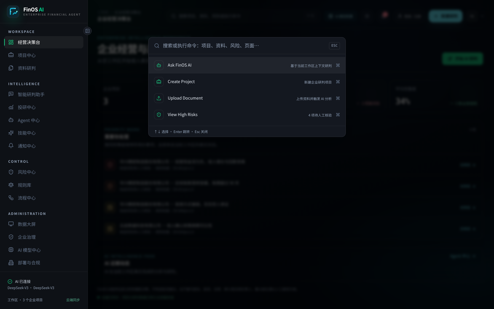

按 `⌘K` 或 `Ctrl+K` 打开全局命令中心，在任意页面都能快速跳转或执行命令。

- **建议动作（Suggested）**：Ask FinOS AI（基于当前工作区上下文研判）、Create Project（新建企业研判项目）、Upload Document（上传资料并触发 AI 分析）、View High Risks（查看 N 项待人工核验）、Configure Model（AI 分析需要先接入模型）。
- **页面（Pages）**：经营决策台、项目中心、资料研判、风险中心、规则库、投研中心、Agent 中心、专属技能中心、通知中心、流程中心、企业治理、AI 模型中心。
- **动态结果**：项目（企业名 + 研判任务）、资料（资料名 + 状态）、风险（风险标题 + 企业）。
- **操作提示**：`↑↓ 选择 · Enter 跳转 · Esc 关闭`。

建议动作会随工作区状态变化：没有项目时优先提示创建项目，没有模型时优先提示配置模型，存在待核验风险时优先提示查看风险。

---

## 5. 项目中心

### 5.1 项目列表（`/cases`）

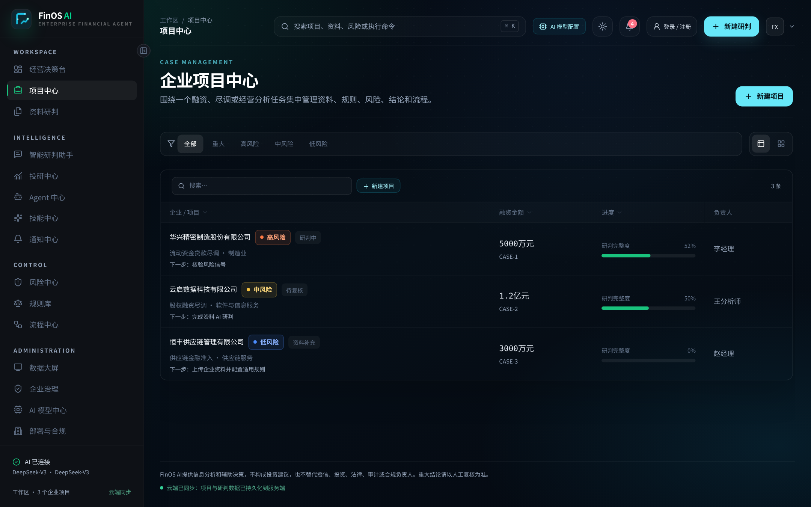

项目中心围绕一个融资、尽调或经营分析任务，集中管理资料、规则、风险、结论和流程。页面顶部提供「新建项目」主操作，并支持表格 / 看板双视图切换。

**表格视图字段：** 企业 / 项目、融资金额、进度、负责人。进度列以「研判完整度」呈现，归档项目带有「已归档」标识，并展示「下一步：」动作提示。

**风险筛选：** 全部、重大、高风险、中风险、低风险。

**空状态：** 没有项目时提示「还没有企业项目」，并说明「从一个真实的企业经营、融资或风险研判任务开始，工作区不会自动填充任何示例数据」；筛选无结果时提示调整搜索词或风险条件。

### 5.2 看板视图

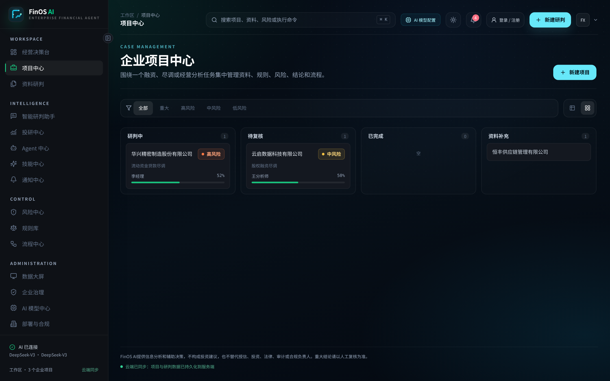

看板视图按项目状态分列：研判中、待复核、已完成，另有资料补充列。每个项目以卡片呈现，便于按阶段推进。

### 5.3 新建项目

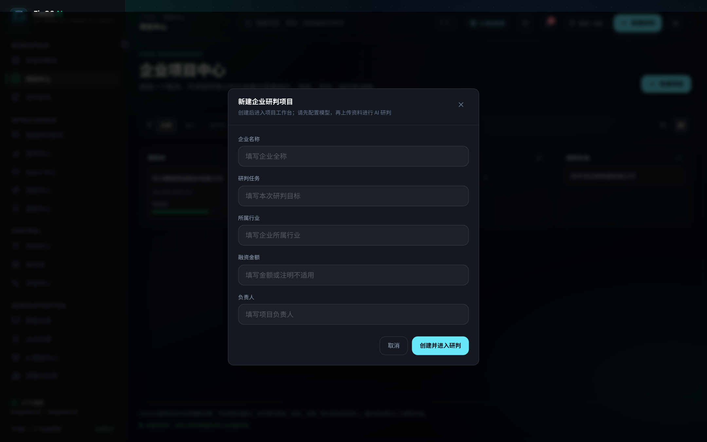

新建项目对话框字段包括：企业名称、研判任务、所属行业、融资金额、负责人。对话框说明「创建后进入项目工作台；请先配置模型，再上传资料进行 AI 研判」。填写后点击「创建并进入研判」直接进入项目详情。

---

## 6. 项目详情工作台

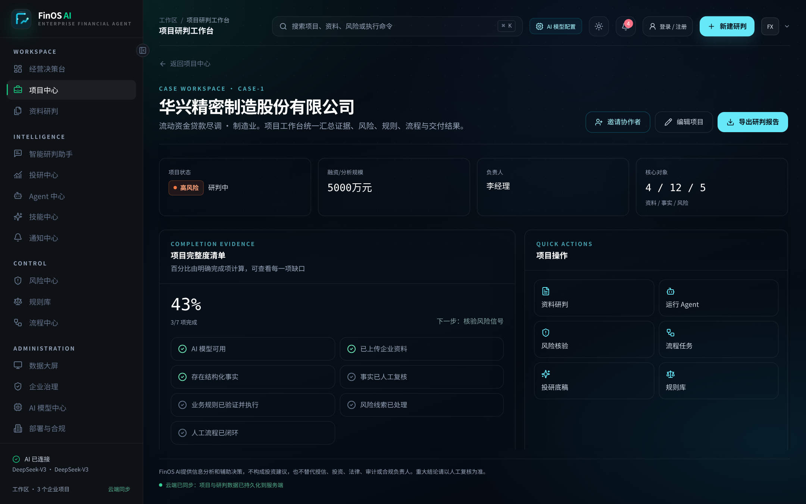

项目详情是单个企业项目的统一工作台，汇总证据、风险、规则、流程与交付结果。页头提供「邀请协作者」「编辑项目」「导出研判报告」三个主操作。

**概览卡：** 项目状态、融资 / 分析规模、负责人、核心对象（资料 / 事实 / 风险）。

**主要面板：**

1. **项目完整度清单（Completion evidence）**：百分比由明确完成项计算，可查看每一项缺口。完成项包括 AI 模型可用、已上传企业资料、存在结构化事实、事实已人工复核、业务规则已验证并执行、风险线索已处理、人工流程已闭环，并显示「N/N 项完成」与「下一步：」。
2. **项目操作（Quick actions）**：资料研判、运行 Agent、风险核验、流程任务、投研底稿、规则库。
3. **结构化事实与引用（Evidence ledger）**：只展示当前项目资料提取的事实；待复核事实不能作为最终结论。
4. **确定性财务指标（Financial analysis）**：仅在相关科目存在时计算，不用模型补齐缺失数据，支持跨期变化展示。
5. **候选与已确认风险（Risk）**：带风险评分标签「评分 {score}/100 · {band} · 未缓释 {openCount}」。
6. **人工任务（Workflow）**。
7. **项目活动摘要（Audit trail）**。
8. **工作区适用规则（Rule readiness）**：规则为工作区级，项目负责人仍需确认适用性。
9. **项目 Agent 运行（Agent records）**。
10. **项目研究底稿（Research records）**。
11. **外部数据联动（External linkage）**：拉取公开汇率与 LPR，折算金额并写入研判报告；所有外部数据仅供参考，需人工复核。
12. **研判交付（Deliverable）**：导出的 Markdown 报告包含事实引用、财务指标、风险状态和人工流程；导出前会提示先处理待复核事实与候选风险。

**邀请协作者：** 邀请按邮箱绑定身份，对方用该邮箱注册 / 登录并接受后，自动获得本项目的协作权限。可同时设置组织角色（分析师 / 复核人 / 只读 / 管理员）、数据密级（内部 / 机密 / 严格受限 / 公开）和本项目协作权限（查看 / 复核 / 编辑 / 项目管理）。

**归档：** 项目可归档与恢复，归档后仍在列表中保留「已归档」标识。

---

## 7. 资料研判

资料研判是整个链路的入口，支持文本解析、图片 OCR、表格结构识别和真实行号 / 图像坐标，所有事实进入人工复核。单文件上限 10MB。

### 7.1 双栏研判工作区

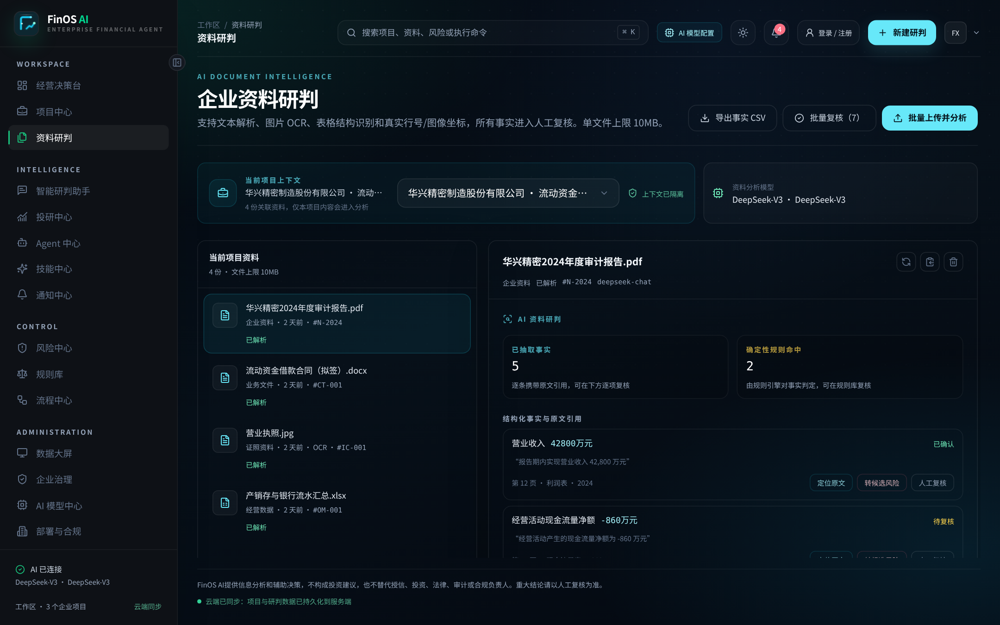

资料研判采用左右双栏布局：左侧是「当前项目资料」列表，右侧是选中资料的 AI 研判详情。两栏各自独立滚动，长内容不会撑高整页。页面支持「批量上传并分析」，并提供「导出事实 CSV」「批量复核（N）」等操作。顶部显示「资料分析模型」，未配置模型时提示「尚未配置模型 · 去配置」；存在失败资料时显示「有 N 份资料分析失败」并提供「重试当前项目失败项」。移动端切换为「资料列表（N）」与「AI 研判详情」两个视图。

### 7.2 结构化事实与原文引用


事实台账逐条展示抽取结果，每条携带原文引用与位置坐标，并提供三个操作：

- **定位原文**：跳转到引用在文档中的位置并高亮。
- **转候选风险**：把事实升级为待核验风险线索。
- **人工复核**：打开复核对话框。

详情区还提供「规则执行结果」与「表格结构识别」（N 张表 / N 行），并支持「跨期指标对照」——同一指标按口径归一化后的跨期值（含单位），用于趋势与异常复核。

**生成阶段可视化：** 分析过程中界面展示四阶段管线：解析文件结构与文本 → 抽取结构化事实（模型调用）→ 规则引擎确定性判定 → 生成研判叙述（模型调用）。

### 7.3 表格结构识别

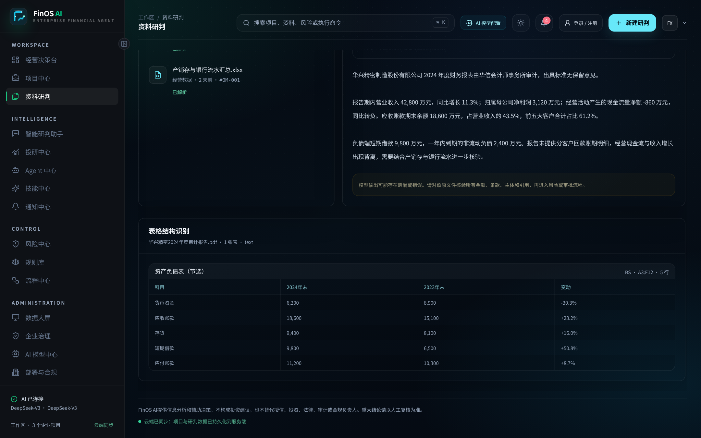

Excel / CSV 与包含表格的 PDF 会被解析为结构化表格，保留 sheet、单元格范围与表头，让财务科目、产销存等数据可直接对照。

### 7.4 人工复核事实

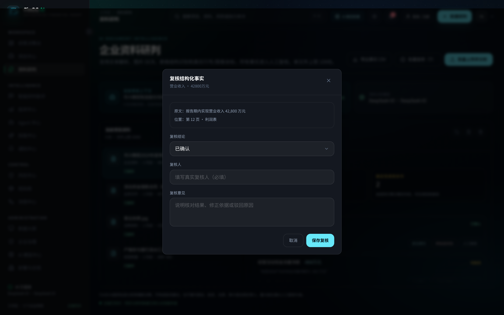

复核对话框记录复核结论（已确认 / 已驳回 / 待复核）、复核人和复核意见。批量复核对话框可将当前项目 N 条「待复核」事实一次性标记为已确认，并要求填写复核人。

**导出的 CSV 表头**：主题、数值、单位、期间、复核状态、复核人、原文引用、位置、来源资料。这样导出的数据可以脱离系统独立审计。

---

## 8. 风险中心

风险提示必须同时呈现事实证据、命中规则、潜在影响与核验状态，避免黑箱评分和无依据结论。

### 8.1 风险列表与矩阵

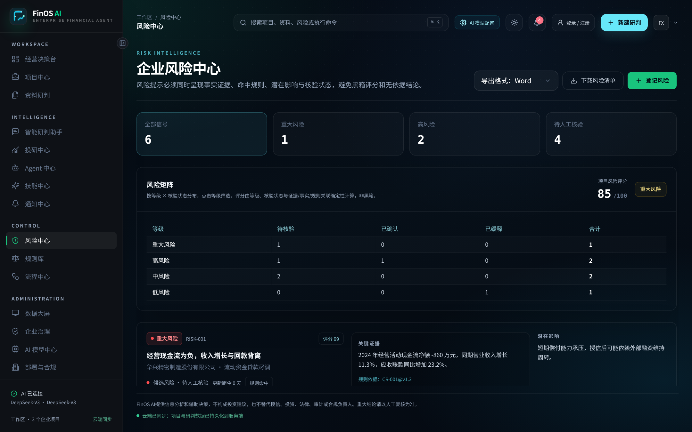

页面顶部提供导出格式选择（Word / PDF / Markdown）与「下载风险清单」「登记风险」操作。

**筛选卡：** 全部信号、重大风险、高风险、待人工核验。

**风险矩阵：** 行为重大 / 高 / 中 / 低，列为待核验 / 已确认 / 已缓释 / 合计，并汇总「项目风险评分」与「{band}风险」。

**风险卡：** 展示评分、候选风险标签、关键证据、事实引用与规则引用，并提供「登记缓释措施」。

顶部警示条明确：风险信号用于辅助研判，不直接替代授信、投资或合规决策；所有重大结论需由有权限的业务人员复核。

### 8.2 结构化风险详情


点击风险打开结构化详情抽屉，固定七个区块：

| 区块 | 内容 |
| --- | --- |
| What · 发生了什么 | 风险描述 |
| Severity · 等级 | 风险等级与评分 |
| Evidence · 证据 | 关键证据与事实引用 |
| Matched Rule · 命中规则 | 规则依据与规则编号 |
| Impact · 潜在影响 | 对经营或偿付的影响 |
| Human Review · 人工复核 | 核验人、时间与意见 |
| Traceability · 溯源 | 来源与关联对象 |

**登记风险：** 仅录入可追溯、可复核的风险信号，字段包括关联项目、风险标题、关键证据、规则依据、潜在影响与风险等级。人工核验与缓释登记都会写入审计记录。风险来源分为 AI 线索、人工登记、事实台账、规则命中四类。

---

## 9. 规则库

规则库把准入制度、审查要点与监管要求转化为可版本化、可测试、可解释的机器规则，并保留原制度依据。

### 9.1 规则列表

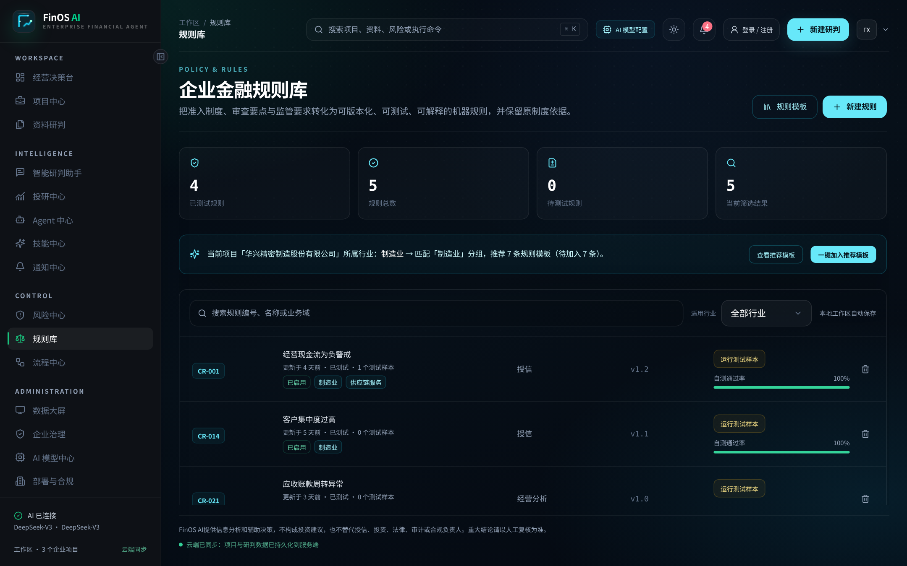

**指标卡：** 已测试规则、规则总数、待测试规则、当前筛选结果。

**搜索与筛选：** 支持按规则编号、名称或业务域搜索，并按适用行业筛选。本地工作区自动保存。

**规则行：** 展示启用状态（已启用 / 已停用）、版本、业务域、自测通过率，并可直接「运行测试样本」。缺少结构化条件的规则会提示无法自动测试。

### 9.2 规则模板库

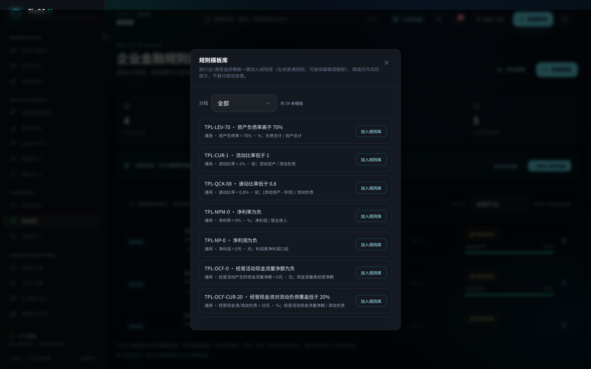

规则模板库按行业 / 通用分组提供模板，可一键加入规则库。模板说明明确：生成的是普通规则，可继续编辑或删除；阈值仅作风险提示，不替代授信政策。当当前项目所属行业匹配某个分组时，页面还会推荐相应模板并支持一键加入。

### 9.3 决策逻辑 Visual View


展开一条规则可以看到决策链：`IF` 条件节点以 `AND` 连接，`THEN` 节点表示满足全部条件时生成风险信号，由规则引擎对已抽取事实做确定性判定。规则支持启用 / 停用、版本管理与删除。

**新建规则：** 填写规则编号、版本、名称、业务领域，以及可选的触发条件（事实指标 + 比较符 + 阈值）。阈值约定：货币按元填写，百分比填数字。规则创建后先进入待测试状态。

**测试样本：** 填写测试数值、单位（元 / 万元 / 亿元 / %）、期望结果（应命中 / 不应命中）、测试证据与测试人，执行并保存结果。测试通过率会累积在规则上，形成自测覆盖记录。

---

## 10. 流程中心

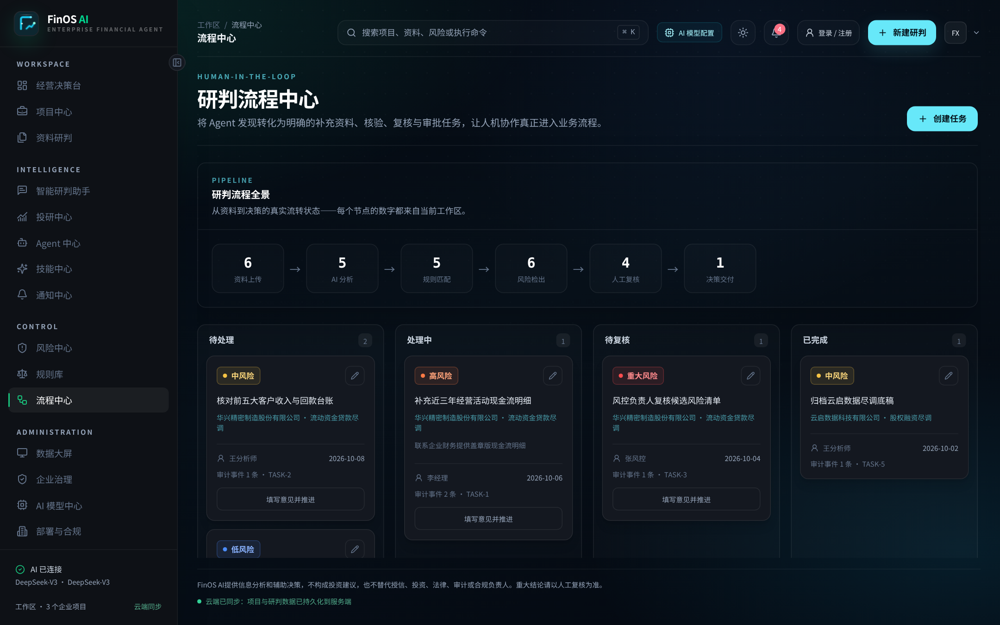

流程中心把 Agent 发现转化为明确的补充资料、核验、复核与审批任务，让人机协作进入业务流程。

**研判流程全景（Pipeline）：** 从资料到决策的真实流转状态，节点为资料上传 → AI 分析 → 规则匹配 → 风险检出 → 人工复核 → 决策交付，每个节点的数字都来自当前工作区。

**任务看板：** 按待处理 / 处理中 / 待复核 / 已完成四阶段分列。任务卡支持「填写意见并推进」与「编辑、改派或退回」，超期任务显示「已超期」，并记录「审计事件 N 条」。

**任务操作：**

- 创建人工研判任务：任务内容、关联项目、负责人、截止时间、优先级、任务说明。
- 推进人工任务：每次推进都会保存操作人、意见、原阶段、目标阶段和时间，作为项目审计摘要的一部分。
- 编辑、改派或调整阶段：任务内容、负责人、截止时间、优先级、任务阶段、操作人、变更原因。

---

## 11. Agent 中心

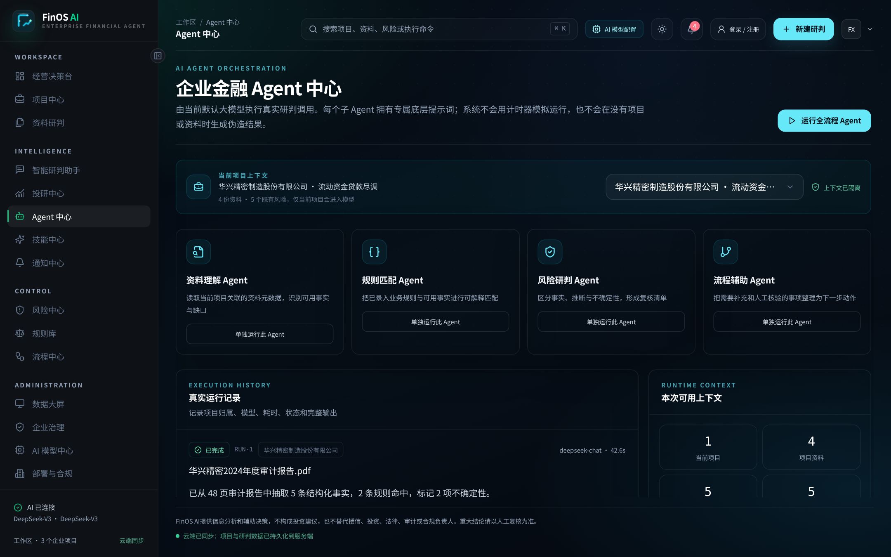

Agent 中心由当前默认大模型执行真实研判调用。每个子 Agent 拥有专属底层提示词；系统不会用计时器模拟运行，也不会在没有项目或资料时生成伪造结果。

**四类子 Agent：** 资料理解、规则匹配、风险研判、流程辅助。每个 Agent 卡显示说明并支持「单独运行此 Agent」，页面主操作可「运行全流程 Agent」。

**实时输出（Live output）：** 模型生成过程实时可见，推理模型可能需要数分钟，可随时取消。界面标注当前使用的技能。

**执行记录（Execution history）：** 记录项目归属、模型、耗时、状态和完整输出。每条运行可展开执行轨迹（Run 编号），轨迹节点为加载工作区上下文 → 模型研判（{模型}）→ 产出已保存，等待人工复核，并提供「登记为风险信号」「转为流程任务」两个后续动作。

**本次可用上下文（Runtime context）：** 当前项目、项目资料、全局规则、项目风险。侧栏还列出「执行边界」四条约束。

**空状态护栏：** 研判链路尚未就绪时，页面分别引导「配置模型」「创建项目」「上传当前项目资料」，不会在缺少前置条件时伪造运行结果。

---

## 12. 智能研判助手

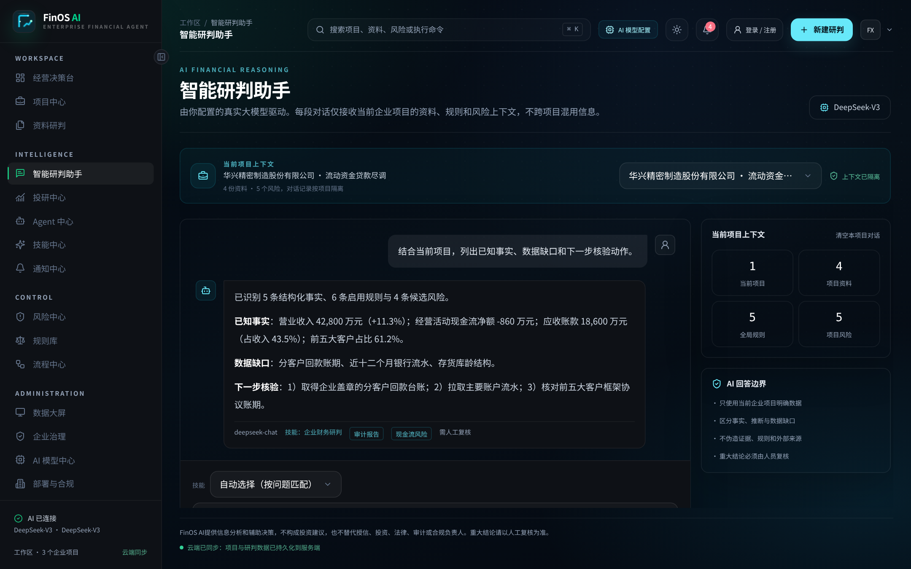

智能研判助手由你配置的真实大模型驱动。每段对话仅接收当前企业项目的资料、规则和风险上下文，不跨项目混用信息。

**引导问题：** 根据当前工作区，列出已知事实、数据缺口和下一步核验动作 / 检查现有资料能否支持企业经营风险判断 / 结合现有规则，给出需要人工复核的事项。

**技能选择：** 支持「自动选择（按问题匹配）」或手动指定，说明「本次对话强制使用所选技能」。

**输入区：** 支持流式输出，生成中可取消，并提示「模型正在研判工作区上下文」。

**当前项目上下文侧栏：** 当前项目、项目资料、全局规则、项目风险，并提供「清空本项目对话」。

**AI 回答边界（写入系统约束）：** 只使用当前企业项目明确数据；区分事实、推断与数据缺口；不伪造证据、规则和外部来源；重大结论必须由人员复核。

**空状态护栏：** 未选项目时提示「先选择一个企业项目」，未配置模型时提示「先连接一个 AI 大模型」并跳转模型中心。

---

## 13. 投研中心

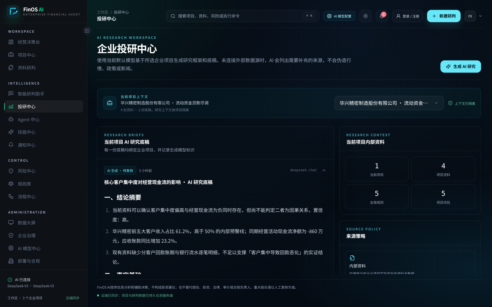

投研中心使用当前默认模型，基于所选企业项目生成研究框架和底稿。未连接外部数据源时，AI 会列出需要补充的来源，不会伪造行情、政策或新闻。

**当前项目 AI 研究底稿：** 每一份底稿均绑定企业项目，并记录生成模型标识，底稿标记「AI 生成 · 待复核」，支持「复制为 Markdown」。

**当前项目内部资料：** 展示可用的内部资料元数据。

**来源策略（Source policy）：** 分为内部资料（仅使用当前企业项目实际存在的资料元数据）与外部来源（未接数据源时只给检索建议，不虚构结果）。

**生成 AI 专题研究：** 填写研究主题（例如「核心客户集中度对经营现金流的影响」）与研究范围，模型只使用当前企业项目上下文，不会自动联网搜索。

---

## 14. 技能中心

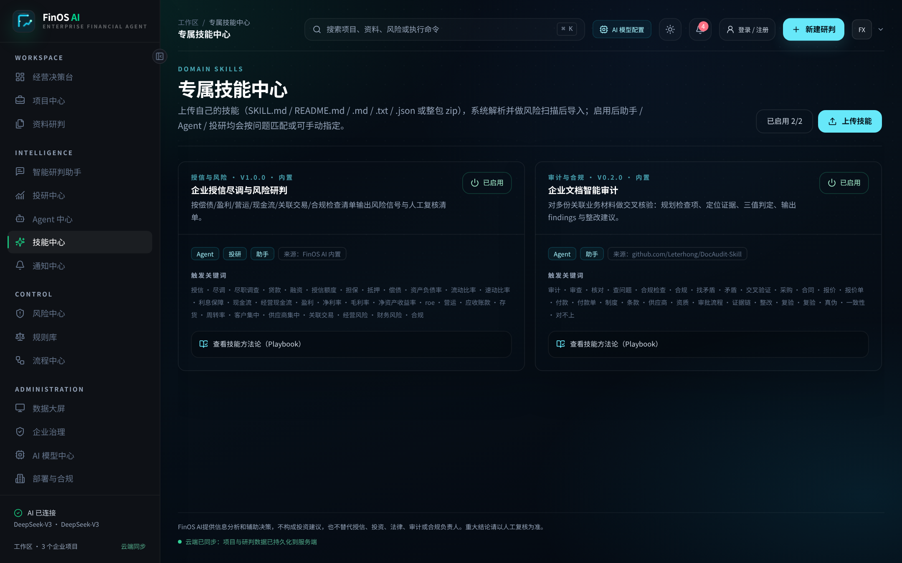

技能中心支持上传自己的技能（SKILL.md / README.md / .md / .txt / .json 单文件，或包含这些文件的整包 zip，上限 5MB）。系统解析并做风险扫描后导入；启用后助手、Agent、投研均会按问题匹配或可手动指定。

**技能卡：** 显示分类、版本、是否自定义、技能说明、来源、触发关键词与适用模式（助手 / Agent / 投研），支持启用 / 停用与查看技能方法论（Playbook）。

**上传技能：** 导入前进行风险扫描，发现风险时列出「风险扫描发现 N 项风险」，并要求「坚持导入（存在风险）」二次确认。可预览将作为系统提示的 Playbook 内容。

---

## 15. 通知中心

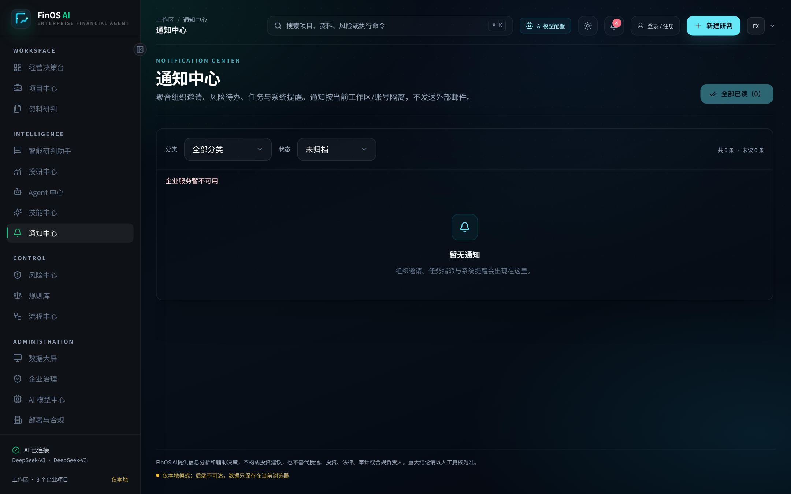

通知中心聚合组织邀请、风险待办、任务与系统提醒。通知按当前工作区 / 账号隔离，不发送外部邮件。

**筛选：** 按分类（财富 / 风险 / 目标 / AI 提醒 / 系统）与状态（未归档 / 已归档 / 全部）过滤，顶部显示「共 N 条 · 未读 N 条」。

**条目操作：** 已读、归档 / 取消归档、删除。页面提供「全部已读（N）」批量操作。

---

## 16. 企业治理与质量控制

企业治理把组织权限、数据分级、规则版本、人工复核、模型评测、数据源和运行观测收敛到同一条可追溯的治理链路。顶部指标卡为组织成员（含邀请）、待人工复核（职责分离）、审计事件（不可见操作也留痕）、AI 调用。

### 16.1 权限与分级

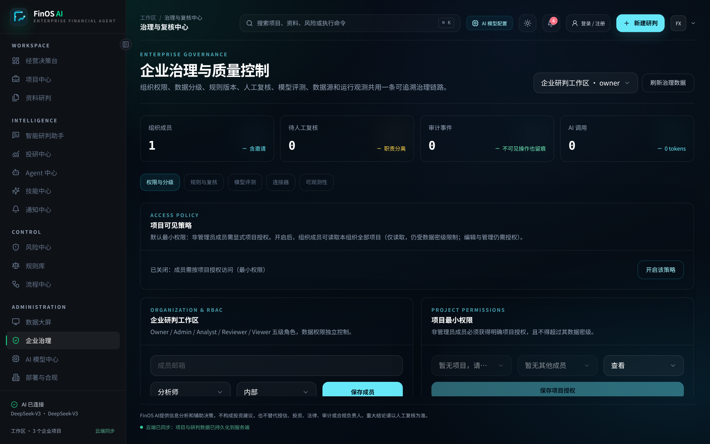

- **项目可见策略（Access policy）**：可开启或关闭该策略。
- **组织与 RBAC（Organization & RBAC）**：Owner / Admin / Analyst / Reviewer / Viewer 五级角色，数据权限独立控制。成员管理支持邮箱、角色、数据密级，成员状态区分「已生效」与「待本人确认」，可复制邀请链接；对方登录后可直接确认。邀请链接采用确认制，对方接受后权限才生效。
- **项目最小权限（Project permissions）**：按项目分配查看 / 复核 / 编辑 / 项目管理权限。
- **项目数据分级（Data classification）**：内部 / 机密 / 严格受限 / 公开。

### 16.2 规则与复核

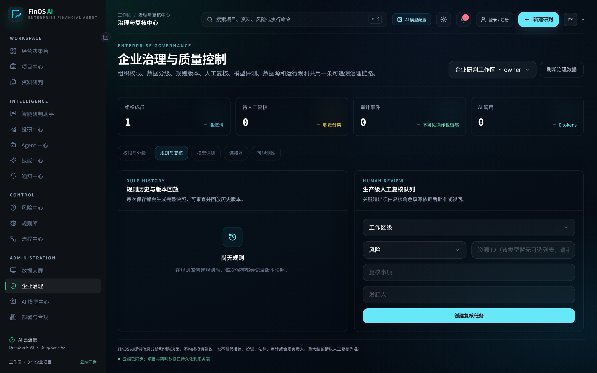

- **规则历史与版本回放（Rule history）**：查看规则变更历史，并支持历史版本回放。
- **生产级人工复核队列（Human review）**：针对风险 / 资料 / 报告 / 流程创建复核任务，支持批准与驳回。

### 16.3 模型评测

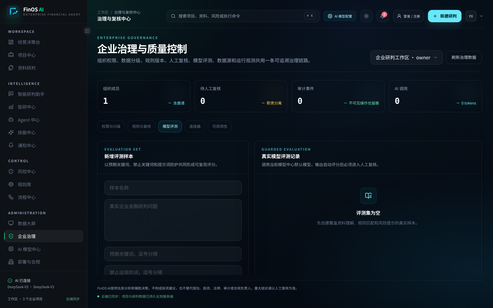

- **新增评测样本（Evaluation set）**：填写样本名称、真实企业金融研判问题、预期关键词与禁止出现的词。
- **真实模型评测记录（Guarded evaluation）**：运行评测并记录最近评分。评测集同时承担细粒度提示词防护的验证职责。

### 16.4 连接器


- **新增受控数据源（Enterprise data sources）**：支持 JSON API 与 CSV API，Bearer Token 仅在服务端加密保存。
- **连接器运行状态（Sync & lineage）**：展示同步状态与数据血缘。连接器强制公网校验、限量与人工复核。

### 16.5 可观测性

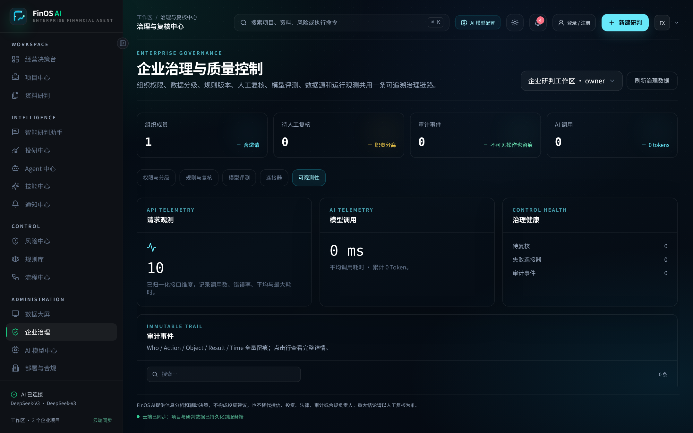

- **请求观测（API telemetry）** 与 **模型调用（AI telemetry）**：观察接口与模型调用的运行指标。
- **治理健康（Control health）**：汇总待复核、失败连接器与审计事件。
- **审计事件（Immutable trail）**：Who / Action / Object / Result / Time 全量留痕。审计表格列为动作、对象、项目、操作者、结果、时间；点击行打开抽屉，查看 Who、Action、Object、Result、When、Source、Details 七段完整详情。

**职责分离：** 复核审批与成员移除都会记录原因并形成审计事件，例如批准复核事项、驳回复核事项、移除成员。

---

## 17. AI 模型中心

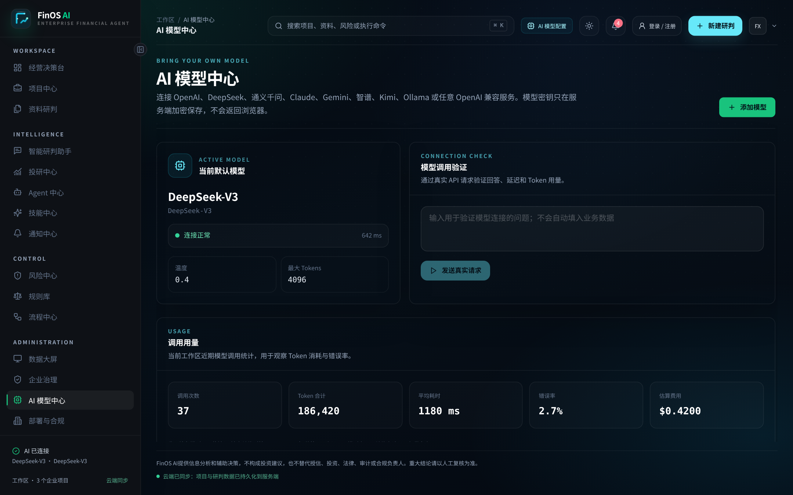

模型中心支持连接 OpenAI、DeepSeek、通义千问、Claude、Gemini、智谱、Kimi、Ollama 或任意 OpenAI 兼容服务。模型密钥只在服务端加密保存，不会返回浏览器。

**当前默认模型（Active model）：** 展示默认模型、温度、最大 Tokens；未配置时提示「尚未配置 AI 模型」并提供「立即接入模型」。

**模型调用验证（Connection check）：** 通过真实 API 请求验证回答、延迟和 Token 用量，可「发送真实请求」。

**调用用量（Usage）：** 展示调用次数、Token 合计、平均耗时、错误率、估算费用，用于观察 Token 消耗与错误率。

**已配置模型（Model registry）：** 首个模型自动设为默认；修改地址、模型或密钥后需重新测试。模型条目显示默认徽标、任务角色标签、最近错误，并提供测试、设为默认、编辑、删除操作。

**状态标签：** 连接正常、连接异常、离线、尚未测试。

**特性卡：** 密钥服务端加密、工作区会话隔离、按任务选择模型。

### 17.1 添加模型

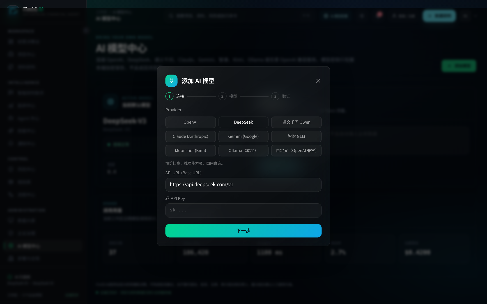

添加模型对话框按供应商填写 Base URL、API Key、模型名称，并勾选任务角色。Ollama 或自建 OpenAI 兼容服务使用自定义 Base URL。

---

## 18. 数据大屏


数据大屏面向值班与汇报场景，提供「监看模式」「刷新」「全屏」控制，并支持总览、风险聚焦、流程与规则三个标签页。

**KPI 卡：** 企业项目、资料总数、结构化事实、待核验风险、重大风险、规则命中、平均进度、项目风险评分。

**总览区块：** 风险等级分布、项目风险评分排行、多期事实趋势、风险热力图、流程任务阶段、规则与事实质量（规则已测试 / 事实已确认）、外部市场数据（USD / CNY 汇率、最新 LPR）、最近更新风险。

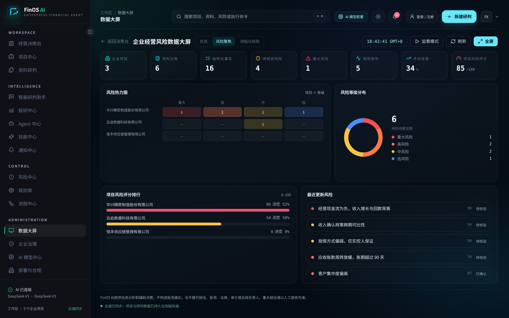

风险聚焦页把待核验与高风险信号前置，适合在会议中快速定位需要处理的项目。

---

## 19. 部署与合规准备

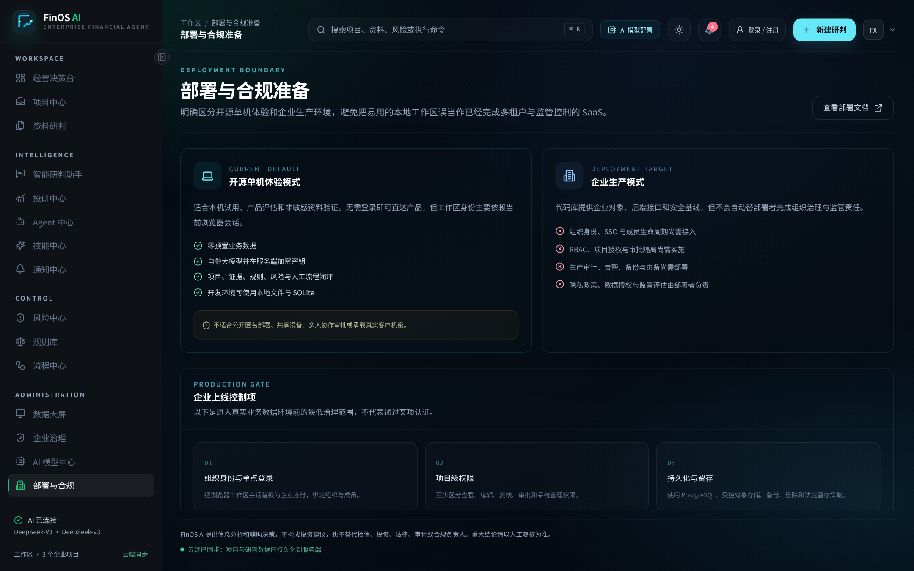

部署页明确区分开源单机体验模式与企业生产模式，避免把易用的本地工作区误当作已经完成多租户与监管控制的 SaaS。

**开源单机体验模式（Current default）：**

- 零预置业务数据；
- 自带大模型并在服务端加密密钥；
- 项目、证据、规则、风险与人工流程闭环；
- 开发环境可使用本地文件与 SQLite。

页面同时警示：该模式不适合公开匿名部署、共享设备、多人协作审批或承载真实客户机密。

**企业生产模式（Deployment target）** 列出尚需补齐的能力：组织身份、SSO 与成员生命周期；RBAC、项目授权与审批隔离；生产审计、告警、备份与灾备；隐私政策、数据授权与监管评估。

**企业上线控制项（Production gate）：** 组织身份与单点登录、项目级权限、持久化与留存、不可抵赖审计、模型与数据治理、运行安全。页面强调这是进入真实业务数据环境前的最低治理范围，不代表通过某项认证。

---

## 20. 使用指引

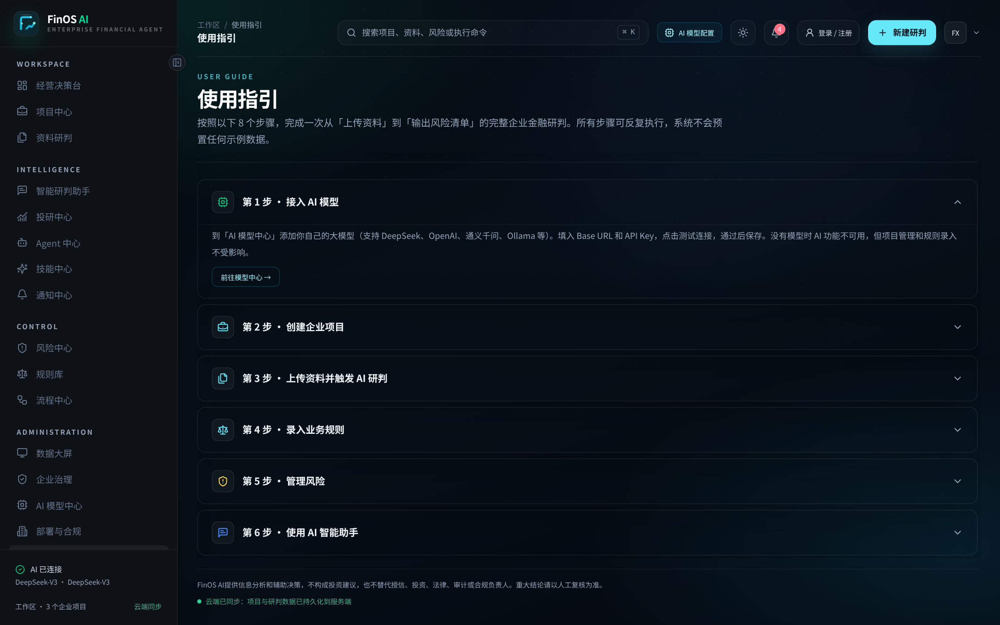

使用指引把完整研判过程拆成 8 个可交互步骤（接入模型 → 创建项目 → 上传资料 → 录入规则 → 管理风险 → 使用助手 → 管理流程 → 企业治理），每一步都有说明和直达链接。页面还包含快捷键说明、数据存储说明（本地即时持久化 / 服务端自动同步 / 多角色协作）、常见问题和核心价值链可视化。

**常见问题覆盖：** AI 分析按钮为何置灰、扫描版 PDF 如何 OCR、数据存在哪里、AI 结论能否直接使用、规则命中异常如何验证、侧栏「仅本地模式」的含义。

---

## 21. 主题、可访问性与响应式

### 21.1 深浅主题


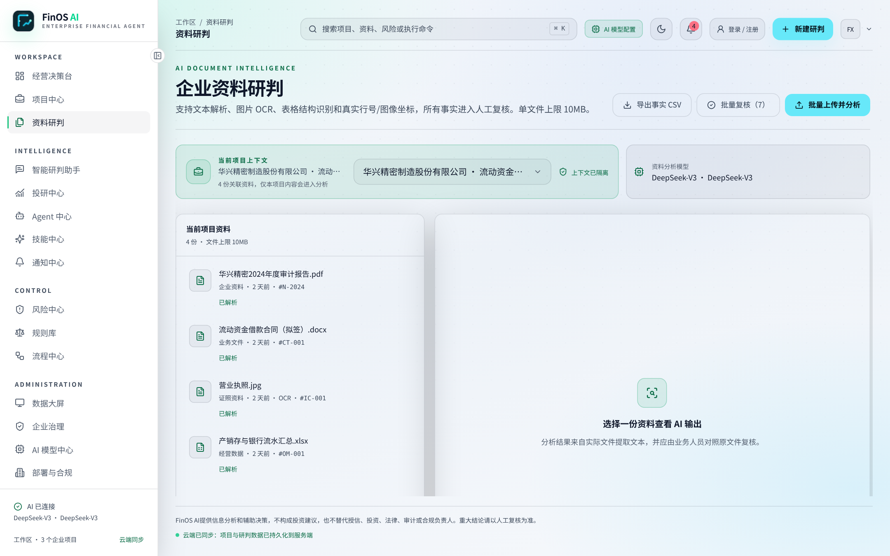

全站支持深色与浅色主题切换。未手动选择时跟随系统偏好并实时响应；一旦用户手动选择，则以用户选择为准。浅色覆盖使用精确令牌匹配，避免命中变体类；浅色配色经过对比度校验，全站达到 WCAG AA。

### 21.2 响应式

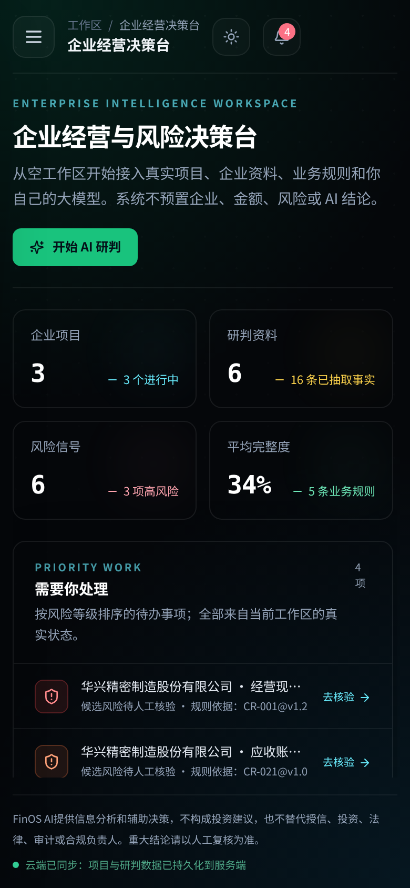

移动端下侧栏收起为抽屉，资料研判切换为列表 / 详情双视图，卡片与表格自适应窄屏。

### 21.3 可访问性与长内容处理

- 对话框与抽屉统一使用焦点陷阱（`useFocusTrap`），打开时聚焦容器，关闭时归还焦点给触发元素。
- 长内容区采用固定高度内部滚动，关键列使用 sticky 对齐，左右两栏各自独立滚动而不撑高整页。
- 资料研判会记忆每份资料的阅读位置，在列表与详情间切换时不丢失上下文。
- 长列表使用渐进加载，避免一次性渲染造成卡顿。

---

## 22. 截图总索引

| 编号 | 页面 | 说明 |
| --- | --- | --- |
| 01 | 经营决策台 | 工作区总览与待办 |
| 02 | 全局命令中心 | ⌘K 搜索与建议动作 |
| 03 | 项目中心 | 表格视图 |
| 04 | 项目中心 | 看板视图 |
| 05 | 新建项目 | 创建企业研判项目 |
| 06 | 项目详情 | 项目工作台全貌 |
| 07 | 资料研判 | 双栏 AI 研判详情 |
| 08 | 资料研判 | 结构化事实台账 |
| 09 | 资料研判 | 表格结构识别 |
| 10 | 资料研判 | 事实人工复核 |
| 11 | 风险中心 | 风险列表与矩阵 |
| 12 | 风险中心 | 结构化风险详情 |
| 13 | 规则库 | 规则列表 |
| 14 | 规则库 | 规则模板库 |
| 15 | 规则库 | 决策逻辑 Visual View |
| 16 | 流程中心 | 研判流程全景与任务看板 |
| 17 | Agent 中心 | 子 Agent 与执行轨迹 |
| 18 | 智能研判助手 | 项目上下文对话 |
| 19 | 投研中心 | AI 研究底稿 |
| 20 | 技能中心 | 自定义技能管理 |
| 21 | 通知中心 | 聚合通知 |
| 22 | 企业治理 | 权限与分级 |
| 23 | 企业治理 | 规则与复核 |
| 24 | 企业治理 | 模型评测 |
| 25 | 企业治理 | 连接器 |
| 26 | 企业治理 | 可观测性与审计 |
| 27 | AI 模型中心 | 模型注册与用量 |
| 28 | 添加模型 | 供应商接入向导 |
| 29 | 数据大屏 | 总览 |
| 30 | 数据大屏 | 风险聚焦 |
| 31 | 部署与合规 | 模式边界与上线控制项 |
| 32 | 使用指引 | 8 步指南 |
| 33 | 浅色主题 | 经营决策台 |
| 34 | 浅色主题 | 资料研判 |
| 35 | 移动端 | 经营决策台 |

---

## 附录：安全与责任边界

- Access Token 默认 15 分钟且仅驻留前端内存，Refresh Token 使用 HttpOnly Cookie，并以原子吊销实现轮换与重放检测。
- 生产环境缺失、过短或使用示例占位值的 JWT / 数据加密密钥时拒绝启动（前后端同一策略）。
- 上传文件分块读取并限制大小，文件路径必须保持在允许目录内。
- Webhook 等出站 URL 拒绝本机、内网、保留地址和自动重定向；模型 Base URL 同样拒绝云元数据 / 链路本地地址，本机与内网地址默认仅限开发环境、生产需显式放行。
- 仅信任明确配置的反向代理来源提供的转发地址（限流与审计同一判定）。
- 模型凭据以 AES-256-GCM 加密落盘，解密失败时拒绝读写并保留原密文；健康检查与错误响应不泄漏内部细节。
- 模型密钥、数据库凭据和企业资料不进入公开仓库或浏览器构建。

FinOS AI 提供应用层组织角色、项目授权、数据分级、复核与审计控制，但这不自动构成完成企业身份接入、基础设施隔离或监管认证的 SaaS 产品。部署者仍须对接真实身份源，并完成日志留存、备份恢复、模型供应商评估和适用地区的监管合规。详见 [部署模式说明](./deployment-modes.md) 与 [安全设计](./security.md)。

---

FinOS AI 基于 MIT License 开源。软件按「原样」提供，不构成投资、授信、法律、审计或合规意见。
